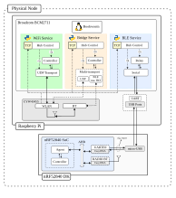

# VERTEX — Virtual Edge Radio Testbed for EXperimentation

An open testbed for distributed and multi-agent control over real heterogeneous
radio links.

## The question it exists to answer

**Does the radio a distributed controller runs over change what it can achieve,
and by how much?**

Simulation cannot settle it, because answering requires a loss model and the
model chosen is most of the answer. A testbed built on one radio cannot settle it
either, since it has nothing to compare against: every number it produces is
about that radio, and nothing separates the medium from the controller.

VERTEX runs **the same control law on every agent** and changes only the
**transport** — BLE advertising, Wi-Fi UDP broadcast, or both at once. Thirty
agents share one fleet, one graph and one clock, so the medium is the only term
that differs and a difference in what the fleet achieves is attributable to it
rather than to the implementation.

That attribution is the whole claim, and defending it is most of the work here.
A testbed that merely runs is easy. One whose comparisons survive a sceptical
reading is not, and the difference lies entirely in what gets checked before a
run and what gets recorded during it.

---

## ⚙️ System Overview

<p align="center">
  
</p> 

### The pieces

- **Node** — one physical unit: a Raspberry Pi with an nRF52840-DK attached over
  USB. Ten nodes make the 30-agent fleet.

- **Agent** (an *edge-device*) — one logical process inside a node. Each node
  hosts up to three, one per transport, and all three at once is the interesting
  case: it is where the CYW43455's BLE and Wi-Fi coexistence behaviour actually
  appears.

  | Agent | Where the control law runs | Medium | Control port | Privileges |
  |---|---|---|---|---|
  | `ble` | on the nRF52840, in C | BLE advertising | 3001 | serial port (`dialout`) |
  | `wifi` | on the Raspberry Pi, in Python | UDP broadcast over the LAN | 3002 | none |
  | `bridge` | on the Raspberry Pi, in Python | both, joining the two subnetworks | 3003 | `CAP_NET_ADMIN` (HCI) |

  A port per type means the hub addresses an agent by host address alone and
  still reaches the intended one of the three, and any single agent can be
  restarted without disturbing its neighbours on the same Pi. State broadcasts
  share UDP port 3010.

- **Access point** — the local Wi-Fi LAN carrying both the control plane and the
  Wi-Fi agents' state broadcasts. It is not passive scenery: it buffers broadcast
  frames and releases them on its beacon boundaries, which makes it a scheduler
  that the BLE side has no equivalent of. That asymmetry is measurable, and it is
  one of the platform's results rather than an implementation detail.

- **Hub** — runs on a laptop. Pushes configuration, triggers the run, and collects
  each node's log when it ends. It also decides the single epoch the whole fleet
  timestamps against, which is what makes samples from different nodes
  comparable at all.

- **User interface** — none yet. Runs are driven from the command line and read
  back with `tools/plot_run.py` and `tools/compare_runs.py`.

### Tested with

One row per piece above, because the requirements are not the same on each and
the hub is not a node:

| Piece | Tested with |
|---|---|
| **Hub** (laptop) | Python 3.12.3 |
| **Node** — Raspberry Pi | Raspberry Pi OS Bookworm, Python 3.11.2 |
| **Node** — nRF52840-DK | nRF Connect SDK 2.7.0 (Zephyr `v3.6.99-ncs2`), board `nrf52840dk/nrf52840` |
| **Access point** | any 2.4 GHz AP; its channel is read and recorded per run rather than configured here |

Python **≥ 3.11** is the actual requirement (`pyproject.toml`); the two versions
above simply reflect two different machines, and nothing in the project depends
on them matching. Python packages come from `pip install -e .` — numpy ≥ 1.26,
pydantic ≥ 2.7, networkx ≥ 2.8, pyyaml ≥ 6.0, pyserial ≥ 3.5, matplotlib ≥ 3.8.

Install them into a virtual environment on each Pi, not system-wide. Bookworm's
system Python has no `pydantic` at all and a numpy below the floor above, so
every agent exits immediately against it. **The virtual environment must be
active in the shell you run the agents from** — `scripts/agents.sh` uses
whatever `python3` resolves to and does not go looking for a venv on your
behalf, which is deliberate: an agent should run against the interpreter you
chose, not one a script guessed at. Step 3 creates it, step 4 checks it.

---

## What the platform guarantees

These are the properties that make a between-transport comparison meaningful.
Each is enforced by a check, not by intention:

- **One law, two implementations, proven equivalent.** The C law on the nRF and
  the Python law on the Pi are cross-validated against each other on every
  `test/check_all.sh` run, and agree to float32 precision.
- **One clock.** The hub sends a single epoch with the trigger and every clock
  holder is rebound to it, so samples from different nodes share an origin.
- **One configuration, or none.** Configuration is applied as a barrier: unless
  every agent acknowledges, no agent starts. An unreachable node aborts the run
  rather than quietly reducing the graph to a different one.
- **Identical payloads.** Both radios emit a byte-identical advertisement, same
  elements and same length, so neither arm pays for payload the other does not.
  Advertising *interval* is a separate matter, set per radio from the manifest
  and recorded per run, because the two controllers do not honour a requested
  range the same way.
- **Per-link delivery, measured.** Sequence numbers travel in every packet and
  reach the log, so delivery, loss, duplicates and reordering are derivable per
  link, including links terminating at an nRF.
- **Radio settings recorded, not assumed.** What was asked for and what the
  controller granted are both written into every run, because they differ.

---

## 🚀 Implementation Steps

### 0. Check it without hardware first

```bash
pip install -e .
bash test/check_all.sh          # every check that needs no board and no radio
python3 tools/simulate.py       # every manifest, simulated, ~1 s each
```

`check_all.sh` covers firmware syntax and symbols, host/firmware frame layouts
for all three firmwares, the on-air codec in both directions, the C law against
the Python law, the BLE transport against a fake controller, HCI socket reuse,
the manifest generator, and the whole hub → agents → logs → collect path on
loopback. It ends in `all checks passed` or names what failed.

Worth doing after **any** edit to a frame layout or the control law: the two
checks that catch a one-sided change — `serial layout` and `control law C vs
Python` — cost seconds here and cost a bench session otherwise.

---

### 1. Flash the nRF52-DK firmware

1. Build and flash the firmware located in
   `firmware/nordic`.
   Use **Nordic SDK 2.7.0**.
   ```bash
   west build -b nrf52840dk/nrf52840 firmware/nordic
   west flash
   ```
2. Refer to the [Nordic DevAcademy courses](https://academy.nordicsemi.com/) for
   instructions on installing toolchains and flashing via nRF Connect or
   `nrfutil`.

What this firmware does: it runs the control law on the board itself. One thread
steps the law and absorbs neighbour packets every `dt`; the other reports one
sample to the Pi every `dt` and advertises the new value every `clock`. Those
three rates are deliberately separate — matching what a Pi agent does, so the two
agent classes are not compared at different resolutions.

**Logs come out over RTT, not UART.** `uart0` carries the binary protocol, and
console text interleaved with frames corrupts them — the CRC then rejects frames
that were never damaged on the wire, which reads as a link fault. Use
`JLinkRTTLogger`, `nrfjprog --rtt` or `west attach`.

Verify a freshly flashed board before wiring it into a fleet:

```bash
python3 test/nrf/check_board.py
```

It pings, checks the board *rejects* a malformed frame, configures and triggers a
run, collects STATE reports, and confirms something is on the air. It also fails
if the control law starts more than 100 ms after the trigger, which is the
regression it exists to catch.

---

### 2. Prepare the Raspberry Pi devices

1. Flash each SD card with **Raspbian Bookworm OS** and enable the **SSH server**.
   Default credentials:
   ```bash
   username: ---
   password: ---
   ```
2. Install required packages:
   ```bash
   sudo apt-get update
   sudo apt-get upgrade
   sudo apt install chrony
   sudo apt-get install -y libopenblas0 iw
   ```
   `libopenblas0` is numpy's BLAS backend; `chrony` is what makes timestamps from
   different nodes comparable at all. `iw` is usually present already on Raspberry
   Pi OS, and it is listed here because the agents call it programmatically rather
   than only you calling it by hand: it is how Wi-Fi transmit power gets set and
   how the interface's power-save state, channel and power are read back into
   every run's record. Without it a run still completes and simply records no
   wireless state, which is worse than failing because nothing says so.
3. Configure chrony NTP server:
   ```bash
   sudo nano /etc/chrony/chrony.conf
   ```
   And add your specific clocking server. Then confirm it actually reached a
   source — the reference ID must not be `00000000`:
   ```bash
   chronyc tracking
   ```
   This is worth checking on every host, every time. The hub hands out one epoch,
   but each node still stamps arrivals with its **own** clock, so an unsynchronised
   host produces one-way delays that are really the difference between two nodes'
   clocks — a number in the right units and wildly wrong. Offsets of −10 s and
   +20 s have been measured this way, and nothing in the data says the delay is
   fictitious.
4. Verify and note the `wlan0` IP address:
   ```bash
   ip -br a
   ```
5. Reboot

**Keep the hosts identical.** 

---

### 3. Configure the experimental environment

**On every Raspberry Pi.** None of this is shared: each step below is host
state, and a Pi that missed one runs a different experiment from the rest
of the fleet without saying so.

1. To avoid BlueZ taking control of the BLE host controller interface (hci), turn
   it down
   ```bash
   sudo systemctl disable --now bluetooth   # or
   sudo hciconfig hci0 down
   ```
   and run
   ```bash
   sudo setcap cap_net_admin,cap_net_raw+eip $(readlink -f $(command -v python3))
   ```
   The HCI **user channel** is exclusive: exactly one process may hold `hci0`, and
   BlueZ counts. The `readlink -f` matters too — a virtualenv's `bin/python3` is a
   symlink, and file capabilities only live on regular files, so without it the
   capability silently lands on nothing.

   Only the `bridge` agent needs this; `ble` needs the serial port and `wifi`
   needs nothing. Elevating all three would be simpler and wrong — it makes every
   run log root-owned and hands the radio to processes that never touch it.
2. Attach or connect the nordic device to one of the raspberry usb ports and
   identify it:
   ```bash
   ls -l /dev/ttyACM*
   ```
3. Give current user permissions to access to serial ports
   ```bash
   sudo usermod -aG dialout $USER #  agent's serial port; needs a re-login
   ```
4. To avoid sleep cycles (unstable network behaviour) for the wlan WiFi
   controller, set `power_save off`
   ```bash
   iw dev wlan0 get power_save      # want it off
   sudo iw dev wlan0 set power_save off
   ```
   Not hygiene: a sleeping station's frames wait for the next beacon, which
   turns a ~1 ms link into a ~170 ms one. It does **not** survive a reboot.

5. Let the agents set Wi-Fi transmit power, by allowing `iw` under `sudo`
   without a password:
   ```bash
   sudo -n iw dev wlan0 info >/dev/null 2>&1 && echo ok || echo "needs a sudoers rule"
   ```
   Transmit power is declared per experiment (`tx_power_dbm` in the manifest) and
   applied by the agent at the start of each run, so there is nothing to set by
   hand and nothing to redo after a reboot. This check is only confirming the
   agent will be allowed to do it. Raspberry Pi OS normally passes already; if
   not:
   ```bash
   echo "$USER ALL=(ALL) NOPASSWD: /usr/sbin/iw" | sudo tee /etc/sudoers.d/vertex-iw
   ```

6. Clone the repository
   ```bash
   git clone <repo-url>
   cd vertex-testbed
   ```
7. Create virtual environment
   ```bash
   python3 -m venv myvenv
   source myvenv/bin/activate
   ```
8. Install system packages
   ```bash
   pip install -e .
   ```
   This is what brings in `pyserial` — a `ble` agent cannot reach its nRF without
   it, and the import is lazy, so a missing install shows up only when that one
   agent type starts.
9. Change in `scripts/agents.sh` the current serial port (`/dev/ttyACM*`), or set
   it per invocation without editing the script:
   ```bash
   export VERTEX_SERIAL=/dev/ttyACM0
   ```
10. Run preflight
   ```bash
   bash scripts/agents.sh preflight
   ```
   Everything after this assumes it passed. Run it on every host before you commit
   to a long run.

---

### 4. Start the agents on each node

Activate the virtual environment first, in the same shell. The script runs
whatever `python3` resolves to, so an inactive venv starts every agent against
the system interpreter, where `pydantic` does not exist:

```bash
bash scripts/agents.sh start
bash scripts/agents.sh status
bash scripts/agents.sh logs bridge     # follow one of them
```

`status` is the one that matters. `start` reports what it launched, not what
survived, so a `started` line is not evidence an agent is running.

Three processes per node, one per type, each with a pidfile and a log. They come
up, open their control port, and **wait** — no run has started, and no epoch
exists yet. Starting the agents is not starting an experiment, which is why they
can sit idle between runs.

The script deliberately does not pass an epoch. The epoch is per-run and the hub
sends it with the trigger, so every node in a run shares one origin; an epoch
fixed at launch would give each agent its own.

---

### 5. Generate the experiment manifests

Run this on the hub, not on the Pis. Manifests are generated rather than written
by hand: every file in `experiments/` opens with "Generated by
tools/make_manifests.py -- edit that, not this", and a hand edit is silently
reverted the next time the generator runs.

```bash
python3 tools/make_manifests.py --campaign \
  --hosts 10.6.5.1,10.6.5.2,10.6.5.4,10.6.5.5,10.6.5.7,\
10.6.5.8,10.6.5.9,10.6.5.10,10.6.5.12,10.6.5.13
```

`--hosts` is the one part of a manifest that cannot be derived, and the part
that changes when a Pi is re-imaged or swapped, which is why it is an argument
rather than an edit. Pass the `wlan0` addresses noted in step 2, in order: node
*k* of each band lands on host *k*.

Without `--campaign` the script writes only the small test set, into
`experiments/test/`, and leaves the campaign manifests alone. That is the safe
default: regenerating a campaign manifest mid-analysis changes the experiment
under the data already collected.

#### What a manifest contains

A manifest is one experiment, fully specified. It has four blocks, and they
correspond to the three things an experiment varies plus the fleet it runs on.

**`radio:` — the transport layer.** Applies to every node; the `ble` agent
programs it into the nRF and the `wifi`/`bridge` agents into `wlan0`.

| Field | Meaning |
|---|---|
| `adv_interval_ms` / `adv_interval_max_ms` | advertising interval, as a range. The controllers do not agree on how to read it: the nRF sits near the minimum, the CYW43455 uses the maximum. Size the **maximum** against the publish period, or the slower radio overwrites values before transmitting them |
| `scan_interval_ms` / `scan_window_ms` | listening period and the portion of it spent listening. Their ratio is the receive duty cycle |
| `tx_power_dbm` | Wi-Fi transmit power, applied and read back per run. Omit it and the driver default is used, which reports an untrusted placeholder and is therefore unknown |
| `channel_map` | which of the three advertising channels to use, as a bitmask; `7` is all three |
| `passive_scan` | passive scanning never sends a scan request, so it costs no transmit airtime |
| `filter_duplicates` | must stay off: here a repeated advertisement is fresh data, not a duplicate |

**`controller:` — the control algorithm layer.** Identical on every agent, which
is what makes a transport comparison meaningful.

| Field | Meaning |
|---|---|
| `dt_s` | local update period. The recursion is `x += dt*(u+nu)`, so the gains below are **rates** and carry across a change of `dt` unchanged |
| `gain_ij` | coupling gain on the edges |
| `alpha` | exponent of the sign-power coordination term |
| `eta` | adaptation rate of the estimated disturbance bound |
| `delta` | dead-band; adaptation stops inside it |
| `disturbance:` | per-agent disturbance: a sinusoid (`sine_amplitude`, `sine_frequency_hz`), a uniform term (`noise_amplitude`, `noise_offset`) and a drift (`beta`). `period_samples` must span the longest run, or the disturbance repeats inside one |

**`structure:` and `nodes:` — the graph and the fleet.** `structure` names a
generator (`ring`, and its parameters) that expands into each node's neighbour
list; `nodes` carries the id, host address, agent type and publish period of all
thirty. `publish_period_s` sits here rather than in `radio:` because it is a
property of the application, not the link, even though it is what the radio
block has to be sized against.

`seed` fixes initial conditions and every agent's disturbance stream, so two
runs of the same manifest at the same run index are replicates.

#### Changing something

Edit the generator, then regenerate and read the diff:

```bash
$EDITOR tools/make_manifests.py
python3 tools/make_manifests.py --campaign --hosts <as above>
git diff experiments/          # nothing you did not intend should move
```

Where to look, by intent:

| To change | Edit |
|---|---|
| a control gain, `dt`, the disturbance shape | `CONTROLLER_40HZ` / `CONTROLLER_25HZ`, and `NU_0` for the disturbance magnitude |
| advertising or scanning | `radio_dithered()`, plus `ADV_FLOOR_MS`, `ADV_DITHER_MS`, `K_MIN` |
| Wi-Fi transmit power | `WIFI_TX_POWER_DBM` |
| the topology or which manifests exist | `CAMPAIGN_SET` / `TEST_SET` and the block that builds them |

Two of these are computed rather than typed, and that is deliberate. The
advertising range is sized from the publish period so every published value is
radiated at least once before being overwritten, and the disturbance terms are
sized as fractions of one bound `NU_0` so the bound stays verifiable by adding
them up. Setting either by hand is how a configuration ends up transmitting
fewer values than it produces, or claiming a bound its own parameters exceed.

Each line of output reports the node and edge counts, the algebraic connectivity
`lambda2`, and a count of warnings. `lambda2` is the one to read: it sets how
fast that topology can converge at all, independently of any radio behaviour.

---

### 6. Trigger the run from the hub

```bash
python3 -m vertex.hub status experiments/n30-ring4-40hz.yaml       # are all nodes reachable
python3 -m vertex.hub run experiments/n30-ring4-40hz.yaml --duration 300
```

`status` first: it is cheap and it tells you which node is not answering before a
120-second run finds out for you.

The hub configures every node **before** triggering any of them. A run where node
7 was configured and node 8 was not is not a shorter run, it is a different
experiment — so configuration is a barrier, and if any node refuses, nothing
starts. Then one trigger goes out carrying the shared epoch.

Useful flags:

| Flag | What it does |
|---|---|
| `--duration S` | run length in seconds |
| `--only 1,2,21` | bring up a subset of node ids |
| `--run-index N` | selects the initial-condition substream; a different index is a different run of the same experiment |
| `--settle S` | seconds between configuring and triggering |
| `--repeat N` | N runs of the same configuration (see step 7) |

Each node's log is collected into `runs/<manifest>-<run-index>/` as two files per
node: the rows (`.bin`, `.csv` or `.jsonl` — the suffix says how to read it back)
and a `.meta.json` carrying the manifest, the controller parameters, the
interpreter, the radio and Wi-Fi state, and the per-link delivery and delay
counters.

---

### 7. Read the results

```bash
python3 tools/plot_run.py runs/n30-ring4-40hz-0
```

Writes into `results/<run>/`. Panels are coloured **by agent type**, not by node,
because the question is BLE versus Wi-Fi versus bridge: a systematic split shows
up as three bands rather than six unrelated lines. Everything is plotted against
the host clock on the shared epoch, never against the nRF's own clock, which
counts from its own trigger arrival and is not comparable between nodes.

Four things to look at before believing a run:

- **First timestamp near zero** for every node. A first sample at 85 s means a
  clock holder kept its launch-time origin instead of the run's.
- **Trigger spread**, printed by the hub. Tens of milliseconds is normal; hundreds
  means a node was slow to start stepping.
- **Median against minimum delay** per link. The minimum is the propagation floor;
  a large gap between them is queueing, not a slow link. A *negative* minimum is
  residual clock skew, and means chrony is not doing its job.
- **Delivery ratio** per link, from the `.meta.json` counters where they exist.
  The row-derived figure is a lower bound — the rows sample the last-known
  sequence number at the control rate, so two arrivals inside one interval look
  like one.

---

### 8. A measurement, rather than a single run

Run-to-run spread on this platform is not small — BLE delivery has ranged over 6
points across nominally identical runs while UDP moved 2 — so a single run cannot
resolve a small effect. Repeat a configuration and aggregate:

```bash
python3 -m vertex.hub run experiments/n30-ring4-40hz.yaml --duration 300 --repeat 10
python3 tools/compare_runs.py 'runs/n30-ring4-40hz-0-r*'
```

`--repeat` holds the run index fixed, so initial conditions and every node's
disturbance stream are identical across the set and the network realisation is
the only variable. Varying initial conditions is a separate dimension: several
`--run-index` values, each with its own set of repeats, gives the two-factor
design. `compare_runs.py` checks the runs really are replicates before it
aggregates, and reports mean ± sd with n — the sd being the thing that says
whether a difference between two configurations means anything.

---

### 9. Stopping

```bash
bash scripts/agents.sh stop
```

It waits for each process to actually exit before dropping its pidfile — a
survivor still holds `hci0` exclusively, and an untracked holder is what makes
`hciconfig hci0 down` fail with `EBUSY`. If that happens:

```bash
bash scripts/agents.sh hci        # says who holds the adapter
```

`EBUSY` almost never means the adapter is wedged. It means someone holds the user
channel, and the holder has to exit first.

---

## Repository map

| Path | What |
|---|---|
| `vertex/` | the platform: `agent`, `control`, `hub`, `transports`, `serial`, `wire`, `topology`, `analysis`, `sim` |
| `firmware/nordic/` | coordination firmware — the control law in C, on the nRF |
| `test/` | hardware-free checks (`check_all.sh`), plus the two UART/BLE loopback benches |
| `experiments/` | generated manifests — edit the generator, not these |
| `tools/` | manifest generation, plotting, run comparison, simulation |
| `scripts/` | agent supervision and bench diagnostics |
| `deploy/` | systemd units, for when more than one host makes `agents.sh` insufficient |

## Diagnostics

Each of these answers one question and changes nothing:

| Command | Question |
|---|---|
| `bash scripts/agents.sh preflight` | is this host fit to run? |
| `bash scripts/agents.sh hci` | who holds `hci0`, and can it be taken? |
| `bash scripts/host_report.sh` | what differs between these two Pis? (`diff` two of them) |
| `python3 scripts/udp_check.py --interface wlan0` | does UDP broadcast actually cross between hosts? |
| `python3 scripts/adv_floor.py` | what is this controller's real advertising floor? |
| `python3 scripts/check_interpreter.py` | is this interpreter complete, and does it match the others? |
| `python3 test/nrf/check_board.py` | does the attached board configure, run and report? |
| `bash scripts/radio_check.sh` | read-only radio state for one node |

`udp_check.py` is the one to reach for when a Wi-Fi link delivers nothing: run it
on both Pis at once, and a pass means the medium works and the fault is in the
platform, while a fail means the network is not carrying broadcast and no amount
of agent debugging will help.

## Constraints worth knowing before designing a run

- **The advertising interval is a delivery ceiling.** Publishing faster than the
  radio advertises overwrites values before they are radiated, which is
  indistinguishable from packet loss downstream. The manifest validator warns;
  the hub refuses without `--force`.
- **The CYW43455's advertising floor is 100 ms**, not the 20 ms Bluetooth 5.0
  allows — it enforces the 4.x rule and rejects anything faster outright. So a
  `bridge` cannot publish faster than 10 Hz without capping its own delivery, and
  above that rate the ceiling has to be reported alongside the result.
- **The publish period must be an integer multiple of `dt_s`.** The nRF derives
  its publish interval by integer division; a Pi agent sleeps the period exactly.
  A non-multiple puts the two agent classes on different rates.
- **`ble` and `wifi` agents share no medium**, so an edge between them cannot
  carry a packet however well the graph validates. Bridges are what join the two
  subnetworks; the validator rejects the rest.
- **A BLE agent's neighbour count is capped by the firmware.** Ring topologies of
  degree 4 sit exactly at that limit, which is why the denser manifests put
  bridges at every `ble`/`wifi` boundary.
