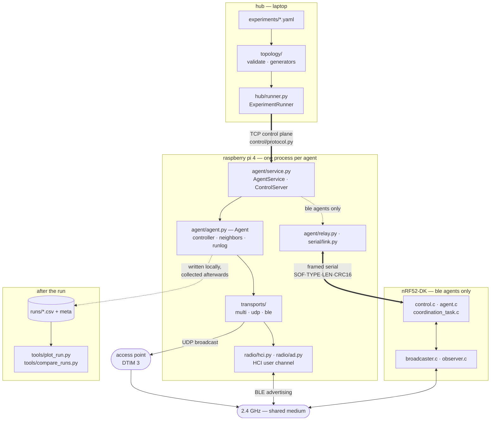
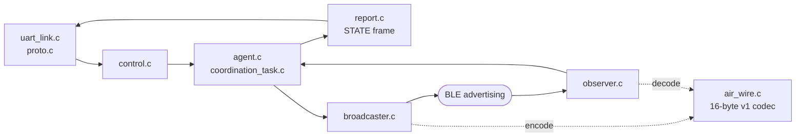
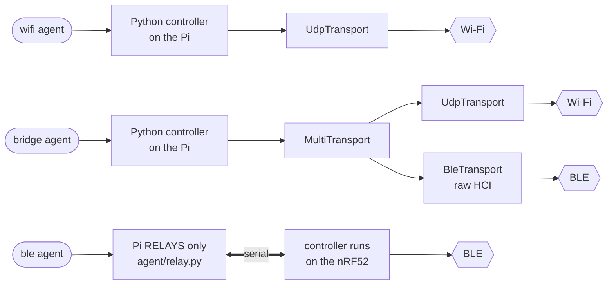

# VERTEX platform

An experimental testbed for finite-time adaptive coordination controllers over a
heterogeneous radio network. Raspberry Pi 4 nodes each host up to three logical
agents (`ble`, `wifi`, `bridge`); each Pi is paired over USB with an nRF52-DK. A
hub on a laptop orchestrates runs.

The point of the platform is to make the *transport* a controlled variable: the
same control law, the same initial conditions, the same disturbance stream, run
over BLE advertising and over Wi-Fi, so that differences in convergence are
attributable to the network rather than to the algorithm.

**This document is current state: design decisions and what has been measured.**
Two companions:

* `RUNBOOK.md` — how to bring up and run an experiment, and the traps.
* `JOURNAL.md` — the dated record of every run, verbatim, in order.
* `CLOCK_MODEL.md` — six different things here are called "clock"; read before
  touching anything time-related.
* `FIRMWARE_DIVERGENCE.md` — where the C and Python implementations disagree.

---

## 1. Design principles

1. **Real links are the product.** Anything a pure simulator can do is not the
   differentiator. Per-link delivery ratio, one-way latency, and radio
   coexistence behavior are first-class outputs, not diagnostics.
2. **Algorithm, transport, and topology are all pluggable.** Today all three are
   hardcoded.
3. **Every run is reproducible from a manifest + a git hash.** Partly true today.
4. **The same controller code runs on hardware, in simulation, and in analysis.**
5. **Prefer traffic engineering over register tweaking** when both solve the
   problem — cheaper, portable, and doesn't depend on closed firmware.

---

---

## 2. Settled decisions

Three decisions are premises, not open questions.

1. **The Pi code is Python, not JavaScript.** The driving reason is raw HCI User
   Channel access: stdlib in Python, a native binding in Node. §3 is the whole
   argument.
2. **The onboard CYW43455 serves both BLE and WLAN.** The TP-Link USB dongle is
   retired and `dtoverlay=disable-wifi` is gone. §3 A2 is why this is defensible,
   and §6.4 is the measurement that shows what it costs.
3. **The Wi-Fi transport is UDP broadcast, not HTTP pull.** TCP retransmission
   inflates TX airtime, which blanks this node's own BLE receiver, which causes
   more loss — a positive feedback loop UDP breaks. §4 C2.1.


### Naming — still open

Current name describes the experiment, not the platform. Candidates:

| Name | Expansion | Character |
|---|---|---|
| **VERTEX** *(lead)* | Virtual Edge Radio Testbed for EXperimentation | Graph pun (vertices/edges) matches the object of study; reuses existing "edge-device" vocabulary |
| **MANTIS** | Multi-Agent Networked Testbed for IoT Systems | Most memorable, unique in search |
| **HERMES** | Heterogeneous Edge Radio Mesh Experiment System | Emphasizes transport layer |
| **TRIAD** | Testbed for Radio-heterogeneous Interacting Agents and Distributed control | Fits today's 3-agents-per-node, but that ceiling is meant to go |

Tagline: *an open testbed for distributed and multi-agent control over real
heterogeneous radio links, on ~$100 of hardware per node.*

Rename touches: repo, `package.json` name (currently `consensus`), the `LABCTRL`
BLE device name (`nordic/prj.conf`, `raspberry/ble.js`, `raspberry/bleadv.sh`),
tmux session name in `start.sh`, RNG seed strings in `net.js` (`FTRAC`,
`FTRAC_run_N` — **changing these changes all initial conditions**, so either keep
them or bump a schema version deliberately).

---

---

## 3. Radio access and coexistence

The central technical constraint of the platform, and the reason for the Python
migration. Everything in this section is implemented unless marked otherwise.

### A1. Root cause: we are two abstraction layers above the knobs

- `raspberry/bleadv.sh` drives `bluetoothctl` via an `expect` script. The
  `advertise` menu exposes manufacturer data and name — **not** advertising
  interval, channel map, TX power, or PHY.
- `raspberry/ble.js` uses BlueZ D-Bus `SetDiscoveryFilter`, whose entire
  vocabulary is `Transport`, `RSSI`, `Pathloss`, `UUIDs`, `DuplicateData`.
  **Scan interval and scan window are not in that API at all.**

So the two parameters that actually determine how fast a bridge sees its BLE
neighbors — advertiser interval and scanner window/interval duty cycle — are
exactly the two that are unreachable. Everything downstream is compensation:
the exponential-backoff respawn in `edge.js`, RSSI-as-liveness, the 2 s stale
cache, and the `_uuidClassification` map that exists only to dodge
`max_match_rules_per_connection=2048` (see `docs/platform_running_info/historical_errors.txt`).

Second-order problem: `bleGetState()` polls BlueZ's *cached* `ManufacturerData`
over D-Bus, at a rate unrelated to the advertising rate, with no reception
timestamp. "Neighbor sent the same value twice" is indistinguishable from
"neighbor is dead and I'm reading a stale cache."

### A2. CYW43455 coexistence — what the datasheet claims, and what it means here

Datasheet (quoted by JI):

> Support is provided for platforms that share a single antenna between Bluetooth
> and WLAN. Dual-antenna applications are also supported. The CYW43455 radio
> architecture allows for lossless simultaneous Bluetooth and WLAN **reception**
> for shared antenna applications. This is possible only via an integrated
> solution (shared LNA and joint AGC algorithm). It has superior performance
> versus implementations that need to arbitrate between Bluetooth and WLAN
> reception.

This is real and it is good news for us — but read the scope precisely.

**What it does say.** One LNA feeds both receive paths; the RF is split after the
LNA and downconverted separately for WLAN and BT, with a joint AGC so neither
desensitizes the other. There is therefore **no RX/RX conflict.** A BLE scanner
at 100% duty cycle does not have to give up airtime to WLAN *reception*. An
external-switch design would have to arbitrate; this one does not.

**What it does not say — and this is the operative limit.** It says
*reception*. Simultaneous **transmission** on a single shared antenna at 2.4 GHz
is physically not on offer: one antenna port, and a transmitting PA both drives
that port and would saturate the co-located receive front end. So:

- **RX + RX → simultaneous, lossless.** (The datasheet's claim.)
- **TX + RX → mutually exclusive.** When WLAN transmits, the T/R switch hands
  the antenna to the PA and the shared LNA is isolated; the BLE receiver is deaf
  for that frame plus turnaround. And vice versa.
- **TX + TX → mutually exclusive.** Arbitrated by the on-chip coexistence engine.

**Therefore:** residual interference between our BLE and Wi-Fi agents is
proportional to **local transmit airtime**, not to total traffic. That reframes
the whole dongle question — see A3.

**Antenna wiring.** The "dual-antenna applications" clause needs a board that
routes two antenna ports. No Raspberry Pi does: Pi 4 has a single PCB trace
antenna shared by WLAN and BT, and CM4's external antenna connector is likewise
shared. We are unavoidably in the shared-antenna case — which is precisely the
case the quote covers, so this is fine.

**Host interfaces are already separate** and are not a bottleneck: on Pi 4, WLAN
is on SDIO, BT is on a PL011 UART at 3 Mbaud (~6600 HCI advertising reports/sec
ceiling — far above our scale, but worth remembering if we ever scan dense
environments).

**Coexistence survives HCI User Channel.** Coex arbitration lives inside the
combo chip between the WLAN and BT cores; it does not depend on the Linux
Bluetooth host stack. So taking exclusive control of `hci0` (A5) does **not**
disable coexistence. These two workstreams compose.

### A3. The airtime argument — this is probably why the dongle was needed

Given A2, the honest hypothesis is that the dongle is a workaround for a
**traffic engineering problem, not an RF problem.**

Today the Wi-Fi agent does `axios.get()` per neighbor per tick — HTTP/1.1 over
TCP. Even with keep-alive, that's request + response + ACKs, each frame carrying
802.11 preamble + MAC/LLC/IP/TCP headers, DIFS/backoff, and possible retries at
a low MCS. Rough order of magnitude at 3–4 neighbors: **~1–2.5% transmit duty
cycle per node**, and every one of those transmit events blanks that node's own
BLE receiver.

A 16-byte binary UDP datagram at the same rate is **one** frame, ~300 µs of
airtime including contention → **~0.3% at ten nodes on a channel**, roughly two
orders of magnitude less local TX airtime.

**The deeper reason UDP wins is not the byte count — it's that its airtime does
not grow under contention.** With TCP, a blanked reception causes a loss →
retransmission → more airtime → more blanking → more loss. Positive feedback,
worst exactly in the loaded case we care about. With UDP a blanked datagram is
just a lost datagram and airtime stays flat. (This is also why C4's sequence
numbers matter: under UDP, loss becomes something we *measure* rather than
something the stack hides from us by retrying.)

**Hypothesis to test: BLE + onboard Wi-Fi coexist acceptably once the Wi-Fi
agent stops using TCP/HTTP, because the RX/RX case is already lossless by
design and the TX/RX case becomes rare.** If that holds, the dongle goes away
*and* the Wi-Fi transport gets better semantics at the same time (see C2 — HTTP
request/response vs. BLE broadcast is currently a confound in any BLE-vs-Wi-Fi
comparison).

Do the UDP work **before** the register work. It is cheaper, portable, and may
make the register work unnecessary.

#### A3.1 Three independent mechanisms — do not conflate them

Reducing airtime only addresses the first. Ranking them is what A7 is for.

1. **Self-blanking (coexistence).** *My* WLAN TX deafens *my* BLE RX, and vice
   versa. Scales with **local transmit airtime**. → fixed by UDP (A3).
   Note the useful corollary: a *neighbor's* WLAN frame arriving while we scan is
   the lossless RX/RX case, so each node governs its own BLE reception quality by
   governing its own Wi-Fi TX. Tractable and local.
2. **Co-channel interference (plain 2.4 GHz collision).** Another node's WLAN
   frame collides in the air with a BLE adv packet at our antenna. Nothing to do
   with coexistence. → **fixed for free by WLAN channel planning:**

   | BLE adv ch | Freq | WLAN ch 1 (2402–2422) | ch 6 (2427–2447) | ch 11 (2452–2472) |
   |---|---|---|---|---|
   | 37 | 2402 MHz | **collides** (lower edge) | clear | clear |
   | 38 | 2426 MHz | clear | **collides** (lower edge) | clear |
   | 39 | 2480 MHz | clear | clear | clear |

   2402 / 2426 / 2480 were chosen to sit in the guard regions around WLAN 1/6/11.
   **Put the LAN on channel 11 and all three adv channels are clear.** Check what
   the router is actually on — if 1 or 6, every frame from every node is colliding
   with adv 37 or 38. Then, once A5 lands, set the **advertising channel map** to
   drop 37 as well. (One of the original motivations for wanting register access.)
3. **Coex policy throttling.** The firmware arbiter deprioritizes BLE scan and adv
   *regardless* of how little airtime we use. Independent of both above.
   → `btc_params` (A4).

#### A3.2 The dongle trades arbitrated interference for unarbitrated interference

Worth stating because it cuts *in favor* of going native. A TP-Link stick
transmitting at ~20 dBm a few centimetres from the Pi's PCB antenna is a strong
in-band near-field interferer, and the two chips have **no coexistence wiring
between them** — neither knows the other exists. The integrated CYW43455 at least
*knows* when both radios want the antenna and schedules around it.

So the real trade is: dongle = unarbitrated, unpredictable interference but a
full-duty BLE scanner; integrated = arbitrated, predictable interference but a
throttled BLE scanner. Which wins is an empirical question (A7), and the
integrated side improves further once we control the scan parameters ourselves (A5).

#### A3.3 Ordering caveat

BlueZ's default scan window/interval duty cycle is unknown and unreachable today
(A1) and **may be losing more packets than blanking ever did.** If so, A5 (HCI
scan-window control) outranks A3 (UDP) for BLE reception specifically. We do not
know which dominates — that is exactly what A7's matrix resolves. UDP still goes
first: cheap, portable, and it fixes the C2 transport confound regardless of how
the ranking comes out.

### A4. Coexistence knobs, if A3 is not sufficient

Even with low airtime, the firmware's default coex *policy* may still deprioritize
BLE scanning and advertising (typical Broadcom policy privileges WLAN's own
traffic and BT SCO/eSCO/connection events; scan and adv are low priority). These
are the "specific registers" that were previously out of reach:

- **`btc_mode` iovar** — coexistence arbitration mode. `0` disables arbitration
  entirely (not what we want — that's mutual destruction), `1` is the default.
- **`btc_params <index> <value>` iovars** — the coex priority/threshold register
  bank. This is the real target. **Indices must be read out of the
  brcmfmac / nexmon sources; do not trust remembered values.**
- **Access path:** `nexutil` (from Nexmon) can get/set arbitrary brcmfmac iovars
  on the 43455. Broadcom's proprietary `wl` utility is the alternative where
  available.
- **Board-level NVRAM** — coex and board flags live in the firmware NVRAM text
  file. Verify locations on Bookworm:
  ```bash
  ls -l /lib/firmware/brcm/ | grep -i 43455   # WLAN fw + clm_blob + NVRAM .txt
  ls -l /lib/firmware/brcm/BCM4345C0.hcd      # BT firmware
  ```
  `boardflags` / `boardflags2` / `boardflags3` carry BTCOEX bits. This file is
  editable — it is the most "register-level" configuration surface available
  without patching firmware.
- **PHY-level Wi-Fi** (monitor mode, injection, CSI) → **Nexmon** patched
  firmware; `nexmon_csi` supports the 43455c0 used on Pi 3B+/4.

Separately, and independent of coex, the plain nl80211 knobs matter and are
easy (`pyroute2`, or `iw`): **`iw dev wlan0 set power_save off`** (power save adds
tens of ms of non-deterministic latency — check this on current hardware, it may
already be polluting collected data), fixed MCS/rate, TX power, channel and
bandwidth, A-MPDU aggregation (a jitter source), and WMM access category via
DSCP / `SO_PRIORITY` so state packets land in the Voice AC.

### A5. Reaching the BLE parameters: raw HCI User Channel

`socket(AF_BLUETOOTH, SOCK_RAW, BTPROTO_HCI)` + `bind((dev_id, HCI_CHANNEL_USER))`
takes exclusive control of `hci0` (BlueZ must release it first: `hciconfig hci0 down`)
and speaks HCI directly:

| Command | OGF/OCF | Unlocks |
|---|---|---|
| LE Set Advertising Parameters | 0x08/0x0006 | interval min/max, adv type, **channel map**, filter policy |
| LE Set Advertising Data | 0x08/0x0008 | payload (replaces the `expect` script) |
| LE Set Scan Parameters | 0x08/0x000B | passive/active, **scan interval + window** (window == interval → 100% duty) |
| LE Set Extended Adv Parameters | 0x08/0x0036 | 2M / Coded PHY, secondary channel, per-set TX power |
| LE Set Extended Scan Parameters | 0x08/0x0041 | per-PHY scan config |

Two structural wins beyond the parameters: we receive **raw HCI LE Advertising
Report events at the moment of reception** (real timestamps, real packet counts —
no cache, no freshness guesswork), and there is **no D-Bus**, so the match-rule
exhaustion bug cannot occur.

~200 lines of `socket` + `struct` in Python (stdlib). In Node it needs a native
binding — this is the single strongest argument for the language switch (§2).
Alternative if we don't want to hand-roll: [Bumble](https://github.com/google/bumble),
Google's Python Bluetooth stack, which does user-channel HCI and exposes the
full command surface.

**Honest limit:** the CYW43455 LE controller firmware is closed. HCI is the
deepest legitimate interface; actual silicon registers are not exposed. If
"register-level" means HCI parameter control, this delivers all of it. If it
means PHY-level, escalate to A6.

#### A5.1 The existing C++ min-BLE stack — port, sidecar, or bind? *(OPEN)*

One of JI's developers has already written a **minimal BLE stack in C++ over
`socket()`**. That is exactly this layer, already built. Three ways to use it,
and the choice matters for the whole deployment story:

| Option | Cost | When it's right |
|---|---|---|
| **a) Port the knowledge, not the binary** — read it as the reference spec, reimplement in pure Python | one-time reading effort; no build system | **default choice.** The stack is ~200 lines of `socket`+`struct` territory; the *valuable* part is the HCI command sequencing, controller quirks, and event-parsing edge cases it already encodes. Extract those, drop the C++ |
| **b) Sidecar daemon** — keep the C++ as a separate process, speak msgpack/lines over a unix socket | small protocol to define | the stack is large and battle-tested, or it does something genuinely timing-critical. Gains: crash isolation (a segfault doesn't kill the agent), no GIL interaction, no build coupling, and it drops straight into the `Transport` ABC (C2) as `BleHciTransport` → local daemon |
| **c) In-process binding** — pybind11 / nanobind / cffi | ARM build or wheel on every Pi, ABI + lifetime management, two-language debugging | **last resort.** Only with a *measured* latency reason |

Reasoning against (c) as the default: it re-imports the two-language problem the
Python migration is meant to remove (§2, decision 1), and it puts a cross-compile or
per-Pi build into the deployment path (D6) for a hot path that isn't hot — the
latency-critical operation is a `recv()` loop over HCI advertising reports, and
the 3 Mbaud BT UART caps at ~6600 reports/s, which pure Python clears comfortably.

**Prefer (a); fall back to (b) if the stack is substantial.** Note that (b) beats
(c) even when we want to keep the C++, and is the better shape for a testbed:
the BLE radio becomes a replaceable service rather than a linked dependency.

#### A5.2 The connection-oriented option *(future, JI 2026-08-26)*

Separate from *how* to reuse the stack: what it would let the platform do. A
connection-oriented BLE transport is the BLE analogue of the UDP unicast proposal
in §4 C2.2, and it bears on two open problems.

**The run-start stall (§6.10).** Connectionless advertising has no
acknowledgement, so a link that goes silent is indistinguishable from one that is
merely lossy, and nothing recovers it -- measured as `21→2` silent for up to 96 s
with no mechanism to notice or retry. A connection has link-layer acknowledgement,
retransmission and a supervision timeout: the same fault would either self-recover
or drop the connection and reconnect, and either way it becomes an **observable
event** rather than a hole in the data. Both configuration hypotheses for that
stall (duplicate filtering, advertising-interval collision) have been eliminated
by experiment, so a transport-level fix is now the more promising direction than
further parameter search.

**The one-bridge-per-host limit (§8.3).** The reason 30 agents cannot run on three
Pis is that the HCI user channel is exclusive, so a host carries at most one
`bridge`. That is a property of *how the platform takes the controller*, not of
the radio: an in-house stack owning the socket could host several logical agents in
one process, and BT5 extended advertising provides multiple advertising sets with
independent addresses and data. If that works on the CYW43455, agents-per-host
stops being 1 and the 30-agent target becomes reachable on existing hardware. That
needs checking against the controller's advertising-set count before it is
believed.

**Note on the mechanism.** §6.4's explanation was corrected on 2026-08-26: the
asymmetry is the 83x difference between BLE receive duty (100%, continuous
scanning) and BLE transmit duty (1.2%), not an inability of PTA to arbitrate
receives. A connection-oriented transport changes this picture substantially,
because a connection's receive windows are *scheduled* rather than continuous --
the receiver knows when the peer will transmit, so its front-end request drops
from 100% to the connection's own duty cycle. That is arguably a stronger argument
for connections than the retransmission one.

**The cost, and it is not small.** Connections add retransmission, and
retransmission hides the raw loss this platform exists to characterise. Every
delivery figure in §6 is a *link* measurement precisely because nothing retries;
under connections those numbers would measure the retry policy instead, and would
not be comparable with anything collected so far. Airtime also becomes
O(degree), exactly as C2.2 notes for unicast. So this is a second transport to
compare against broadcast, not a replacement for it -- which is the same
conclusion C2.2 reached, and for the same reason.

**Blocked on reading the code.** Decide once we've seen its size and what quirks
it handles — those quirks are the asset either way, so the first task is a read-through
and a written list of what it knows that a naive implementation wouldn't.

Note: advertising and scanning simultaneously from one controller (what the
bridge needs) requires the controller to support concurrent adv + scan roles —
verify against the 43455's LE feature bits before committing.

### A6. Escalation: own the controller (nRF52840 as HCI radio)

Flash an nRF52840 dongle with Zephyr's `hci_uart` sample; plug into each Pi as
its BLE radio over USB CDC. The Pi then has a controller whose firmware **we**
compile. Strictly better than the TP-Link workaround: it frees the onboard chip
for Wi-Fi-only duty, adds 2M and Coded PHY, and makes exotic behavior a firmware
change in code we already build (per-packet `RADIO`→`TIMER` capture
timestamping, custom adv scheduling, channel-map hopping, connectionless CTE for
AoA). ~$10–20/node.

Beyond that, for *characterized* rather than *realistic* channels: nRF `RADIO`
in proprietary mode (Nordic ESB or custom) — deterministic TDMA slots,
µs timestamps. Keep as a third transport, not a replacement.

---

## 4. Transports

### C2.1 UDP transport — design consequences *(decided; details open)*

Switching Wi-Fi from HTTP/TCP to UDP is decided (§10). It is not a drop-in
substitution — it changes four things that need deciding together.

**1. It inverts the communication model: pull → push.** Today the fetcher *pulls*
(`axios.get('/getVState')`). UDP naturally *pushes*: each agent broadcasts its own
state at its own rate and neighbors listen. **This is what makes the Wi-Fi agent
structurally identical to the BLE agent**, which has always been push/broadcast —
and it is the whole point of the C2 confound fix, so take the push model
deliberately rather than emulating request/response over UDP.

Consequences to handle:
- `/getVState` leaves the hot path. Keep the endpoint for diagnostics only.
- **The `clock` parameter changes meaning** — from "how often I fetch" to "how
  often I publish." Same number, different semantics; logged runs before and after
  are not directly comparable on this axis. Bump the log schema version (D4).
- `neighborReceived` gets *truer*: "a fresh packet arrived from j since my last
  step" rather than "my fetch call succeeded."
- **The neighbor table becomes the primary mechanism, not a fallback.** Both
  transports collapse to one structure: `{neighbor_id → (state, seq, rx_time)}`.
  `_neighborStateCache` in `edge.js` is currently a fallback for failed fetches;
  under push it *is* the design, shared by BLE and Wi-Fi alike. This deletes a
  whole class of special-casing.

**2. Broadcast vs. unicast — broadcast wins, and by more than it looks.** One
frame reaching all neighbors makes airtime **O(1) per node instead of
O(degree)**. Rough comparison at degree 4:

| | Airtime per publish |
|---|---|
| 4× unicast @ high MCS | ~4 × 150 µs ≈ **600 µs** (each with ACK + SIFS + DIFS/backoff) |
| 1× broadcast @ 6 Mbps basic rate | ~**250 µs** (no ACK) |

Broadcast still wins despite the low basic rate, and it grows better with degree.
It also matches BLE semantics exactly — broadcast to all, filter by sender ID in
the payload — which is the apples-to-apples comparison we want.

*Verify:* subnet broadcast vs. IP multicast. Multicast risks IGMP snooping and
AP-side buffering quirks; subnet broadcast sidesteps IGMP entirely and is simpler.
Test both. (AP power-save buffering shouldn't apply once `power_save off` is set,
but confirm rather than assume.)

**3. No ACKs means loss is real and must be measured, not hidden.** This is the
upside — see A3's feedback-loop argument — but it hard-requires **C4's sequence
numbers**. Without them we've traded a retry mechanism for nothing observable.
**C4 is a prerequisite for C2.1, not an optional companion.**

**4. Scientific-validity note worth stating in write-ups.** Under broadcast, every
node hears every node; the topology becomes a *software* filter over a physical
broadcast medium. A "link failure" is therefore enforced in software, not
physically. This is already true of the BLE agent (all nodes are in radio range),
so it isn't a regression — but it should be explicit in any paper: **the platform
studies logical topologies over a shared physical medium.** Genuine physical link
failure needs attenuation or distance, which this hardware setup doesn't provide.
Conversely it's a feature: topology reconfiguration without touching hardware.

**Open:** wire format (fold into C4 — one versioned binary layout for both
transports), publish rate vs. controller `dt` decoupling, and whether the
receiver applies a freshness deadline (max age before a neighbor counts as
disabled — the current 2 s `NEIGHBOR_CACHE_MAX_AGE_MS` becomes a real protocol
parameter and should move into the manifest).

- **C3. Single source of truth for the control law.** JS and C will drift. Minimum:
  a cross-validation test running both against one fixture. Better: generate both
  from one spec.
- **C4. Versioned binary payload with sequence number + TX timestamp.** Current
  BLE payload is 6 bytes `[flag | node | int32 vstate]`; the adv packet allows 31.
  Adding `uint16 seq` + `uint32 tx_ts` (+6 bytes) yields **per-link delivery ratio
  and true one-way delay for free**, on both transports, with no extra
  instrumentation. For a platform whose selling point is real links, those two
  numbers are the headline product. **Prerequisite for both A7 and C2.1** —
  under UDP there are no ACKs, so this is the only loss signal we have.
  One layout, versioned, shared by BLE adv and UDP alike.
- **C5. Simulation mode.** N agents, mock transport, one process, 100× real time.
  Validate an algorithm in seconds before touching hardware.
- **C6. Topology validation** via `networkx`: connectivity, strong connectivity,
  balance, spectral gap λ₂ — reported *before* the run, next to the convergence
  rate it predicts.
- **C7. Zeroconf/mDNS discovery** instead of hardcoded IPs.
- **C8. Unicast-per-neighbour as a selectable UDP mode.** *Proposed, not decided.*
  See C2.2 below — broadcast's airtime advantage is real, but it costs 153.6 ms of
  DTIM latency on infrastructure WLAN, measured. Making the mode selectable turns a
  fixed disadvantage into an experimental variable.

---

### C2.2 The latency cost of broadcast — measured, and a proposed option

C2.1 chose subnet broadcast and its airtime argument stands: one frame reaching all
neighbours is **O(1) per node instead of O(degree)**. What it could not know is the
price.

**Measured on `oficina_v2` (BSSID `04:d9:f5:b2:ba:80`), 2026-08-21.** UDP one-way
delay: median 171-175 ms, minimum 16-21 ms, zero duplication, on stations whose own
`power_save` is **off**. The AP advertises a 100 TU beacon (102.4 ms) and
**DTIM period 3**, so its broadcast buffer is 307.2 ms and a frame arriving at a
uniform point in that cycle waits `U(0, 307.2)` — median 153.6 ms. Therefore
`median - min` should equal 153.6 ms on every link, and it does:

```
     link     min   median  median-min   vs W/2
   12->11   20.80   175.36      154.56    +0.96
   22->11   20.70   173.13      152.43    -1.17
   11->12   16.50   171.39      154.89    +1.29
   21->12   17.71   171.66      153.95    +0.35
```

Four links within 1.3 ms — 0.8% — of a figure derived from nothing but the AP's
beacon interval and DTIM period. **Broadcast and multicast through an AP are
buffered to the next DTIM beacon whenever any associated station is dozing**,
including stations that are not ours: turning our own `power_save` off changed
nothing.

Three consequences worth stating plainly.

**It is structural, not congestion.** It is present at low duty with no
contention to speak of. Any claim that the Wi-Fi path degrades under heavier
traffic must be made *on top of* a 153.6 ms offset that has nothing to do with
traffic — and if an earlier analysis attributed this to congestion, it was
attributing a DTIM cycle.

**It inverts the assumed transport ordering.** With a 200 ms publish period, Wi-Fi
neighbour data is nearly a full period stale while BLE is about half that:

| | delivery | median delay | min delay |
|---|---|---|---|
| BLE | 89-90% | 104-108 ms | 5-6 ms |
| UDP broadcast | 98-99% | 171-175 ms | 16-21 ms |

BLE is ~9 points worse on delivery and ~65 ms *better* on latency. Neither
dominates, and each figure has a mechanism: BLE's latency is the advertising
interval, UDP's is the DTIM cycle.

**It explains why degree does not vary traffic under broadcast**, which C2.1 point 4
already implied without drawing the conclusion. Broadcast airtime is
degree-independent, so a ring with degree 4 puts exactly as much traffic on the
medium as one with degree 2 — a degree comparison measures connectivity and
receive-side load, not communication load.

#### The proposal

Make the UDP send mode selectable — `broadcast` (today) or `unicast`, one datagram
per neighbour — as a manifest field beside the radio parameters, recorded in
`RunMeta` like everything else that changes what a run measures.
`UdpTransport` already takes `send_to`, so the change is small; the value is not in
the code but in what becomes measurable.

*Benefit.* Unicast is not DTIM-buffered, so the 153.6 ms term should disappear and
leave the ~18 ms base hop. That gives the platform a Wi-Fi transport usable for
latency-sensitive work, and a *controlled* comparison of the two modes on identical
hardware — which is a result in itself, not merely a fix.

*And it supplies the traffic knob.* Unicast airtime is **O(degree)**. With it, a
degree-2 versus degree-4 comparison genuinely varies communication load, so the
question C2.1 answered on airtime grounds and the G1/G2 question collapse into one
change.

*Cost.* Airtime rises with degree, exactly as C2.1 said — at degree 4 that is 4x
the frames. On a shared medium serving BLE as well, that is the self-blanking
mechanism of §3 A3 acting on purpose rather than by accident. Which is the point:
it becomes a variable.

*Risk.* Unicast needs each neighbour's address, so the transport gains a dependency
on the manifest's `ip` mapping that broadcast does not have; a stale address becomes
a silent per-link failure rather than a whole-transport one. And it re-opens the
scientific-validity note in C2.1 point 4 from the other side: under unicast the
topology is enforced by *addressing* rather than by a software filter over a
physical broadcast, which is arguably more faithful and is certainly different.
Say which one a run used.

*Falsifiable prediction, so the experiment can fail.* Broadcast: median ~171 ms,
distribution roughly uniform from 18 to 325 ms. Unicast: median ~18 ms. **If unicast
returns ~170 ms, DTIM is not the mechanism and this section is wrong.**

*Cheaper first step.* Ask the network owner to set DTIM 1, or point the experiment
LAN at an AP under our control. That would cut the buffer from 307 ms to 102 ms
without any code, and it tests the mechanism just as well. It does not remove the
dependency on someone else's AP configuration, which is the deeper reason to want
the unicast option.

---

---

## 5. What the JS platform got wrong

Found by reading the legacy code. These are the defects the rewrite exists to fix;
none of them were visible in the collected data at the time.

### The six bugs

These are defects in `raspberry/*.js`, kept as a record of what the port has to
avoid rather than as a task list. 1-3 and 6 are closed by design in `vertex`:
`Disturbance` refuses to construct without a seed or an injected stream,
`resolve_local_ip()` names the interface and raises rather than falling back, `decode_manufacturer_data` rejects a
foreign company id instead of guessing, and `StatePacket` raises on int32
overflow rather than wrapping. 4 and 5 are open questions for the new design, not
inherited bugs — the Python agent re-resolves neighbours continuously and copies
before logging, but neither is measured yet.

1. **Disturbance is not reproducible.** `algo.js` `computeDisturbance()` calls
   `Math.random()` directly, while `net.js` carefully seeds `seedrandom('FTRAC')`
   for initial conditions. ICs replay exactly; disturbances never do. **Every
   multi-run comparison inherits this.**
2. **Non-deterministic IP selection.** `net.js` `getIpAddress()` returns the first
   non-internal IPv4 in OS enumeration order — a coin flip when `wlan0` and
   `wlan1` both exist. The deterministic version is commented out right above it.
3. **Manufacturer-data fallback can parse a stranger's packet.** `ble.js`
   `_extractPayload()` falls back to `Object.values(dataRaw)[0]`; any nearby
   advertiser with ≥6 bytes of manufacturer data can be read as a neighbor state.
4. **No dynamic membership.** `bleGetDevices()` runs once at trigger
   (30 × 200 ms ≈ 6 s). A neighbor that reboots or arrives late stays invisible
   for the rest of the run — silently changing the graph the algorithm runs on.
5. **`state.neighborVStates` written by both loops** (`edge.js`, network loop and
   dynamics loop) and assigned by reference → logged snapshots can be internally
   inconsistent.
6. **`int32` at scale 1e6 caps state at ±2147.** Fine today; document or move to
   float32 in the payload (pairs with C4).

---

### The seventh, found later: the advertising interval was never set

`bleadv.sh` drives `bluetoothctl advertise on`, which has no way to specify an
advertising interval, so the bridge agents inherited the controller default while
the nRF agents advertised at `BT_LE_ADV_NCONN`'s 100–150 ms. At the 500 ms publish
period of the original experiments that put the two agent classes on different
delivery ceilings — see §6.3, which quantifies the mechanism, and note that the
ceiling difference follows exactly the axis those experiments compared.

---

## 6. Results on the new platform

All figures below are from `n6-ring`/`n6-fast`: 6 agents on 2 hosts, 25 Hz
dynamics, 120 s runs, 10 repeats with the run index held fixed so initial
conditions and disturbance streams are bit-identical across the set and the
network realisation is the only variable. `JOURNAL.md` has the full record.

### 6.1 The transport trade-off, with error bars

The measurement the platform was built to make. Ten repeats, `n6-fast`:

| path | delivery | median one-way delay |
|---|---|---|
| UDP (Wi-Fi broadcast) | **0.985 ± 0.008** | **171 ± 9 ms** |
| BLE nRF→nRF | 0.964 ± 0.007 | not measured |
| BLE Pi→nRF | 0.934 ± 0.066 | not measured |
| BLE nRF→Pi | **0.832 ± 0.022** | **107 ± 2 ms** |

Convergence: **13.70 ± 0.17 s**, identical initial conditions.

The trade-off is real and it is not in the direction a naive reading would
suggest. **UDP is the more reliable transport and the slower one**; BLE delivers
~60 ms faster and loses 3–17× more. Neither is uniformly better, which is the
result — and note the sd on `Pi→nRF` (0.066) is an order of magnitude above its
neighbours, driven by outlier runs rather than spread (§6.5).

Delay is only measured where a Pi is the receiver: the nRF does not report arrival
timestamps (no STATS frame — §8.1). "Not measured" above is a gap in the
instrumentation, not a zero. The plots render those bars at zero, which is
misleading and should be hatched.

### 6.2 The 171 ms UDP delay is the access point's DTIM cycle

Not congestion, and not the control loop. The AP (BSSID `04:d9:f5:b2:ba:80`)
beacons every 102.4 ms with **DTIM period 3**, so buffered broadcast frames are
released every 307.2 ms. A packet arriving at a uniformly random point in that
cycle waits **153.6 ms** on average.

Measured `median − min` across the UDP links: **152.4–154.9 ms** against a
predicted 153.6 — agreement to **0.8%**.

This matters more than the number. It says the dominant term in Wi-Fi latency here
is a property of the *infrastructure*, fixed by the AP's configuration, and it is
not reduced by sending less or sending faster. It also means UDP latency figures
from this testbed do not transfer to a different AP without restating its DTIM
period. Power save was ruled out separately by re-running with it disabled.

### 6.3 The advertising interval is a delivery ceiling

`broadcaster_update()` and `cmd_le_set_adv_data` rewrite the advertising *payload*;
neither changes how often the controller radiates. A neighbour therefore observes
at most one distinct value per advertising interval, and publishing faster than
that overwrites values before they are ever transmitted:

```
delivery <= min(1, T_pub / T_adv)
```

That is **undersampling at the transmitter**, and it is indistinguishable from
packet loss in any statistic that counts distinct sequence numbers.

Measured over a 4-point × 10-repeat publish-rate sweep with `T_adv` fixed at
100 ms:

| publish | ceiling | nRF→nRF observed | obs/ceiling |
|---|---|---|---|
| 2.5 Hz | 1.000 | 0.997 | 0.997 |
| 5.0 Hz | 1.000 | 0.962 | 0.962 |
| 12.5 Hz | 0.800 | 0.655 | **0.818** |
| 25.0 Hz | 0.400 | 0.331 | **0.826** |

The two capped points normalise to the same number. The apparent collapse from
0.997 to 0.331 is the ceiling, not the medium. UDP over the same sweep is flat
(0.987 → 0.978), because every publish is its own datagram.

#### The ceiling cannot always be lifted: the controller floor

The obvious fix — match `T_adv` to `T_pub` — has a hard limit. **The CYW43455
rejects `ADV_NONCONN_IND` below 100 ms**, returning *invalid HCI command
parameters* on opcode `0x2006`. Bluetooth 4.x required
`Advertising_Interval_Min >= 0x00A0` for non-connectable and scannable undirected
advertising; 5.0 dropped the restriction; this controller kept it. Measured with
`scripts/adv_floor.py` after it cost 10 runs of a sweep.

So **no bridge agent can publish faster than 10 Hz without capping its own
delivery**, whatever the manifest asks for. Above that rate the ceiling is a
property of the hardware and the only honest response is to report it:

| publish | adv (clamped) | ceiling |
|---|---|---|
| 2.5 Hz | 400 ms | 1.00 |
| 5.0 Hz | 200 ms | 1.00 |
| 12.5 Hz | 100 ms | **0.80** |
| 25.0 Hz | 100 ms | **0.40** |

`radio_for()` clamps rather than raising, and the reason is symmetry: the same
value reaches the nRF and the Pi, so both agent classes sit on the *same* ceiling.
Letting the nRF advertise at its own floor while the Pi is pinned at 100 ms would
give the two classes different ceilings — which is exactly the defect §5 identifies
in the JS platform. A platform limit shared by both classes is a measurement
constraint; one that falls on a single class is a confound.

**Consequence: no delivery ratio from this platform is interpretable without
`T_pub / T_adv` stated alongside it.** The sweep that produced this table was
therefore confounded and is being re-run with the interval pinned to the publish
period (§8.2). Two guards now prevent a silent recurrence: `validate.check()` warns
per node, and `vertex.hub --publish-period` refuses outright.

This is also the answer to the reviewer question about mismatched advertising
intervals between agent classes, and it applies retrospectively to the JS platform
— see §5, seventh bug.

### 6.4 nRF→Pi is the weak direction, and the receiver is why

`nRF→Pi` is the worst link class in every measurement, at every rate. The
explanation that fits is JI's, with a correction to its mechanism made 2026-08-26.

The nRF52 is a single-protocol radio with no Packet Traffic Arbitration, and needs
none. The CYW43455 has PTA because WLAN and BLE share one front-end there.

**An earlier version of this section said PTA "can only arbitrate transmissions the
chip itself originates". That is wrong: PTA arbitrates the shared front-end for
transmit and receive alike, on both radios.** The asymmetry is not TX versus RX in
principle -- it is **duty cycle**:

| BLE role on a Pi | share of time the front-end is needed |
|---|---|
| transmit (advertising) | one ~1.2 ms event per 100 ms = **1.2%** |
| receive (scanning) | `scan_window == scan_interval` = **100%** |

An 83x difference in exposure. When WLAN wants the antenna it almost never collides
with the 1.2% transmit request and *always* collides with the 100% receive request.
The receiving direction loses because it asks for the resource continuously, not
because arbitration is unavailable to it.

A second, independent asymmetry compounds it: a transmit can be deferred a few ms
and still fall inside its advertising event's own slack, whereas a receive
opportunity is set by the **remote** transmitter's clock and cannot be moved at
all. That part of the original argument stands.

Corollary, and it is testable: shortening `scan_window` below `scan_interval` cuts
the receive-side exposure proportionally, at the cost of missing advertisements
that fall outside the window. The platform has always run at 100% scan duty, so
this has never been varied.

The RSSI distributions localise it to the Pi's receive path. Geometry is fixed and
the transmitter is the same board in each pair, so a spread difference is a
receiver property:

| case | p5..p95 | span | min | delivery |
|---|---|---|---|---|
| nRF → nRF, neither end shares a front-end | −38..−31 | **7 dB** | −41 | 0.964 |
| Pi → nRF, receiver is the nRF | −44..−37 | **7 dB** | −50 | 0.936 |
| nRF → Pi, receiver is the CYW43455 | −59..−31 | **28 dB** | −91 | 0.824 |
| nRF → Pi, receiver is the CYW43455 | −58..−32 | **26 dB** | −85 | 0.842 |

Four times the spread and a tail 40 dB below the median, on exactly the two links
where the shared front-end receives.

Two readings are excluded by this. **Weak signal**: the medians are within a few dB
across all four, so it is not path loss — what changes is the variance, the
signature of a receiver whose sensitivity is modulated by something other than the
incoming signal. The CYW43455's shared LNA and joint AGC give that a mechanism (§3,
A2). **Pure TX blanking**: blanking loses packets the receiver never hears, leaving
the ones it does hear normal; a 40 dB low tail means the Pi *is* hearing marginal
packets, so its sensitivity is varying rather than being switched off.

The publish-rate sweep supports the asymmetry while refuting a simpler version of
it. Normalised by the §6.3 ceiling, `Pi→nRF` and `nRF→nRF` agree to within 0.02 at
every point, while `nRF→Pi` sits below both and the gap widens 0.03 → 0.23. So the
*level* is the advertising ceiling; the *asymmetry* is the Pi's receive path. Any
claim that falling delivery under load is "coexistence" needs §8.2's experiment,
because `nRF→nRF` — no CYW43455 at either end — fell just as far.

#### Transmit power, measured 2026-08-25: the reported figures are not radiated power

All three Pis report identically, so the fleet is homogeneous and the only
transmit asymmetry is Pi versus nRF:

| radio | reported | settable | note |
|---|---|---|---|
| Pi BLE (CYW43455) | **+12 dBm** | no | vendor command only for legacy advertising |
| Pi Wi-Fi | 31.0 dBm | **yes** | `brcmfmac` placeholder; `iw ... fixed 800` verified to take effect |
| nRF52840 BLE | +8 dBm, requested and granted | yes | RTT only, never reaches the host |

Wi-Fi power is not a cross-class asymmetry at all: only `wifi` and `bridge` use it,
both run on Pis, and all three read the same. It matters only as a deliberate
variable.

**The +12 dBm is not what the CYW43455 radiates.** The nRF receives from two link
classes, so its RSSI compares them directly, and the geometry is identical -- the
bridge and the `ble` agent sit on the same Pi at each end:

| transmitter | median RSSI at the nRF | p5..p95 |
|---|---|---|
| nRF | **−17 dBm** | −17..−16 |
| Pi | **−37 dBm** | −45..−34 |

The Pi's advertisements arrive **20 dB weaker** while the reported powers predict
them arriving 4 dB stronger: a ~24 dB contradiction, so the HCI read returns a
nominal figure rather than radiated power. The likely cause is the shared antenna
path -- BLE and WLAN reach the antenna through one front-end on that chip, and that
costs dB the controller does not account for. The −17 dBm row spans 1 dB across
119,810 samples, which is RSSI saturation at the nRF, so 20 dB is a **lower bound**.

**This strengthens the receiver argument rather than competing with it:**

| direction | arrives at | delivery |
|---|---|---|
| Pi → nRF | −37 dBm | **0.857** |
| nRF → Pi | −32 dBm | **0.663** |

The direction with the *stronger* received signal delivers *worse*, by 0.19. A
receiver given more signal and doing less with it is not a link-budget problem. The
transmit asymmetry runs opposite to the delivery asymmetry, which eliminates it as
the cause and leaves the Pi's receive path as the explanation.

The asymmetry also cannot be removed: the Pi's BLE power is not settable through
any public interface, and the nRF already sits 20 dB above it. Measuring it was the
option available, and that is now done -- `scripts/tx_power.py`.

### 6.5 The completed publish-rate sweep: airtime is not the variable

*(2026-08-25. Four points x 10 repeats x 120 s, 39 of 40 runs usable, identical
initial conditions throughout. Advertising interval matched to the publish period
where the controller allowed it, clamped at the 100 ms floor otherwise.)*

| point | publish | adv | BLE duty | ceiling | conv (s) | nRF→nRF | Pi→nRF | nRF→Pi | UDP |
|---|---|---|---|---|---|---|---|---|---|
| p400 | 2.5 Hz | 400 ms | 0.86% | 1.00 | 16.50 ± 0.33 | 0.885 | 0.854 | 0.678 | 0.991 |
| p200 | 5 Hz | 200 ms | 1.73% | 1.00 | 14.98 ± 0.75 | 0.883 | 0.868 | 0.684 | 0.990 |
| p080 | 12.5 Hz | 100 ms | 3.46% | 0.80 | **13.27 ± 0.14** | 0.703 | 0.678 | 0.518 | 0.973 |
| p040 | 25 Hz | 100 ms | 3.46% | 0.40 | 15.80 ± 0.52 | 0.347 | 0.344 | 0.256 | 0.972 |

#### Normalised by the ceiling, delivery is flat

| link | p400 | p200 | p080 | p040 | spread |
|---|---|---|---|---|---|
| nRF→nRF | 0.885 | 0.883 | 0.879 | 0.868 | **0.017** |
| Pi→nRF | 0.854 | 0.868 | 0.848 | 0.860 | **0.020** |
| nRF→Pi | 0.678 | 0.684 | 0.648 | 0.640 | 0.044 |

Across a **4x airtime range**, per-transmission success is constant to within 2%.
**BLE loss on this testbed is not contention in this range.** It is a fixed
per-transmission failure probability — 0.12 nRF→nRF, 0.15 Pi→nRF, 0.34 nRF→Pi —
multiplied by how many chances each value gets.

p080 and p040 make that a controlled result rather than an inference: identical
airtime (3.46%, both at the floor), different ceilings, and normalised delivery
agrees to 0.011. The ceiling model holds with airtime held fixed.

#### Matching the advertising interval to the publish period was the wrong advice

Earlier guidance here said to pin `T_adv = T_pub` so the ceiling sits at 1.0. That
is necessary but badly incomplete: the ceiling is 1.0 for **any** `T_adv <= T_pub`,
and the number of advertising events carrying one published value is
`k = T_pub / T_adv`. Matching them sets `k = 1`, the minimum, so a single lost
advertisement is a lost value.

Measured at 5 Hz publish, both configurations at ceiling 1.0:

| | nRF→nRF | Pi→nRF | nRF→Pi |
|---|---|---|---|
| `adv` 200 ms, k=1 (`sweep-p200`) | 0.883 | 0.868 | 0.684 |
| `adv` 100 ms, k=2 (`n6-fast`) | 0.964 | 0.934 | 0.832 |
| gain | +0.081 | +0.066 | **+0.148** |

For nothing but advertising twice as often. Independent losses would predict 0.986
/ 0.983 / 0.900; the observed values are all lower, so losses are **correlated** —
a second transmission is worth less than an independent retry, and still worth a
lot.

**Rule: advertise as fast as the controller allows, always.** `radio_for()` now
defaults to the 100 ms floor, and an explicit interval is required to vary airtime
deliberately (the sweep manifests do that, and pay `k = 1` for it).

#### Convergence has an optimum, and it is not the fastest publish rate

16.50 → 14.98 → **13.27** → 15.80 s. Faster publishing helps until it does not.

p080 and p040 deliver the *same* information rate — 8.79 and 8.67 distinct values
per second, both saturated at `adv_rate x p_success` = 10 x 0.87 = 8.7 — yet
convergence differs by 2.5 s. The cause is the staleness window:
`max_neighbor_age_s` defaults to `3 x publish_period`, so it shrinks with the
publish rate while the achievable arrival gap does not.

| point | window (3 x T_pub) | mean gap between delivered values | window / gap |
|---|---|---|---|
| p400 | 1.200 s | 452 ms | 2.65x |
| p200 | 0.600 s | 226 ms | 2.65x |
| p080 | 0.240 s | 114 ms | 2.11x |
| p040 | **0.120 s** | 115 ms | **1.04x** |

At p040 the window is barely one arrival gap, so a large share of values are
already stale when they are used, and the controller discards data it did
receive. It starves itself.

**This is a coupling bug, not a radio result.** The staleness window is sized to
what the agent *intends* to publish; it must be sized to what the medium can
*carry*, which is bounded by the advertising rate. A floor of
`3 x max(T_pub, T_adv)` would fix it. Not changed yet: it alters effective
coupling and therefore invalidates comparison with everything collected so far —
see §8.4.

### 6.6 `n6-50hz` confirms the model, and BLE latency turns out to be `T_adv/2`

*(2026-08-25. 50 Hz dynamics, 10 Hz publish, 2 Hz sine, 10 repeats, 10/10 usable.)*

Predicted from §6.5 before running: convergence at or slightly better than p080's
13.27 s, and delivery near 0.88 / 0.85 / 0.66 because `k = 1` at this
configuration. Measured:

| | predicted | measured |
|---|---|---|
| convergence | ≤ 13.27 s | **13.24 ± 0.21 s** |
| nRF→nRF | ~0.88 | **0.877 ± 0.010** |
| Pi→nRF | ~0.85 | **0.857 ± 0.014** |
| nRF→Pi | ~0.66 | **0.663 ± 0.020** |
| UDP | — | 0.984 ± 0.006 at 177 ± 3 ms |

Delivery predicted to within 0.007 on all three BLE classes. The per-transmission
success model of §6.5 — a fixed failure probability times the number of chances —
is now a predictive model, not a fit.

Convergence equals p080's while carrying a **ceiling of 1.0 instead of 0.80**, which
was the point of the configuration: the same information rate with no undersampling
and a 2.6x staleness margin.

#### BLE one-way delay is `T_adv/2` plus 6 ms, and at `k < 1` it is selection-biased

`nRF→Pi` delay fell from `n6-fast`'s 107 ms to 56 ms. Not an improvement in the
radio — a different point on a simple law. A published value waits for the next
advertising event, so:

* `k >= 1`: the wait is uniform on `[0, T_adv]` → mean `T_adv/2`.
* `k < 1`: only some values are ever advertised, and they are precisely the ones
  published shortly *before* an event → mean `T_adv * k / 2`.

| config | `T_adv` | k | predicted | measured | residual |
|---|---|---|---|---|---|
| sweep-p400 | 400 | 1.00 | 200 ms | 205 ms | +5 |
| sweep-p200 | 200 | 1.00 | 100 ms | 106 ms | +6 |
| n6-50hz | 100 | 1.00 | 50 ms | 56 ms | +6 |
| sweep-p080 | 100 | 0.80 | 40 ms | 46 ms | +6 |
| sweep-p040 | 100 | 0.40 | 20 ms | 26 ms | +6 |

A constant +6 ms offset across a 10x range of predicted delay — fixed processing
cost, not model error.

**So p040's 26 ms is survivorship bias, not low latency.** At `k < 1` the delivered
values are exactly the ones that waited least; the 74% that waited longer were
overwritten and never measured. Any table quoting delay for a `k < 1` configuration
must say so, or it reports the fastest quarter of the traffic as if it were all of
it. `n6-fast`'s 107 ms is the opposite bias: at `k = 2` some values arrive only on
the retry, which pushes the mean above `T_adv/2`.

This also gives the platform a genuine **latency/reliability knob**: `k` trades them
against each other. `k = 1` at the 100 ms floor is the minimum-latency configuration
that is not undersampled (56 ms, delivery 0.66 on the weak link); `k = 2` buys
+0.17 delivery for +51 ms.

### 6.7 Nine agents: a real airtime effect, mostly hidden behind a worse node

*(2026-08-25. 9 agents on 3 hosts, `n9-50hz`, 10 repeats, 10/10 complete, one
excluded from statistics — see below.)*

Two predictions were recorded before the run. One held, one was wrong.

| | predicted | measured |
|---|---|---|
| convergence | ~28 s (lambda_2 scaling) | **24.07 ± 0.26 s** |
| per-link delivery | unchanged from `n6-50hz` | **fell** |

Convergence scaled by 1.82x against the 2.14x that lambda_2 implies. Expected: the
lambda_2 ratio governs the asymptotic *linear* rate, and this law's coupling is a
signed square root, so it is not the right scaling — useful as a sanity bound, not
as a prediction.

#### The airtime effect is real, and smaller than the aggregate suggests

Aggregate delivery fell on every BLE class (`nRF→nRF` 0.877 → 0.797,
`nRF→Pi` 0.663 → 0.606). Reading that as a 1.5x-airtime effect would be wrong:
`n6-*` is pinned to pi2+pi4 while `n9-*` uses all three hosts in order, so the two
experiments do not share their physical links, and **pi1 is a materially worse
node**. Within `n9-50hz` alone, comparing host pairs:

| class | pi2-pi4 | pi1-pi2 | pi1 penalty |
|---|---|---|---|
| nRF→Pi | 0.636 | 0.574 | 0.062 |
| Pi→nRF | 0.812 | 0.688 | 0.124 |

The `pi2-pi4` pair exists in both experiments, so it is the only like-for-like
comparison — same boards, same geometry, same `k = 1`, only advertiser count
differing:

| class | n6 (4 adv, 3.46%) | n9 (6 adv, 5.18%) | delta | Welch t |
|---|---|---|---|---|
| nRF→Pi | 0.663 ± 0.020 | 0.636 ± 0.019 | **−0.028** | **3.62** |
| Pi→nRF | 0.857 ± 0.014 | 0.812 ± 0.078 | −0.045 | 1.80 |

So: **the first genuine contention effect this platform has measured** — but
−0.028, not the −0.057 the aggregate implies. Roughly half the apparent drop is a
property of one Raspberry Pi.

This qualifies §6.5 rather than overturning it. That section found delivery flat
across a 4x airtime range, but produced that range by varying the advertising
interval, which moves `k` at the same time; normalising by the ceiling removed
both. Here `k` is fixed and only the advertiser count changes, and a 1.5x rise in
duty costs about 4% of delivery on the weakest link class. The correct statement is
now "airtime is a weak variable below ~5% duty", not "airtime is not the variable".

**Do not compare `n6-*` and `n9-*` aggregates without conditioning on host pair.**
The host-ordering convention (§7.4) puts node 1 on pi2 in the two-host manifests and
on pi1 in the three-host ones by design, so class means are not comparable across
them.

#### Fourth single-link collapse

`n950-r1`: link `21→2` at 0.103 against ~0.57 for its peers, convergence 40.20 s
against 24.07 ± 0.26. Excluded above. Occurrences to date: `n6-fast` r6 and r9,
`sweep-p200` r1, `n950` r1 — four in about ninety runs, ~4%. Two of the four are
the **second** run of a series, which is a thin pattern but the only one there is.
Still undiagnosed (§6.8), and it now inflates `Pi→nRF`'s sd to 0.088 against 0.018
for its neighbours.

### 6.8 Duplicate filtering costs 0.44 delivery on the Pi, and the answer is asymmetric

*(2026-08-25. `n9-k2` vs `n9-k2-dupfilter`: 9 agents, k = 2, 10 repeats each,
differing in `radio.filter_duplicates` alone.)*

A BLE controller can suppress repeated advertising reports below the host. The
feature exists for device *discovery* -- an advertiser repeating 10x a second
should be reported once, not 600 times a minute. Here an advertisement is a data
packet whose payload changes every publish, so the feature is being applied to a
channel it was not designed for.

| receiver | link | k=1 | k=2 filter OFF | k=2 filter ON | delta | t |
|---|---|---|---|---|---|---|
| **Pi** | nRF→Pi | 0.605 | **0.768 ± 0.089** | **0.331 ± 0.023** | **−0.437** | **21.3** |
| **Pi** | Pi→Pi | 0.898 | 0.976 ± 0.008 | 0.958 ± 0.021 | −0.019 | 3.8 |
| nRF | nRF→nRF | 0.796 | 0.949 ± 0.010 | 0.946 ± 0.013 | −0.003 | 1.1 |
| nRF | Pi→nRF | 0.750 | 0.935 ± 0.074 | 0.924 ± 0.139 | −0.012 | 0.3 |

The nRF rows are the control: its scanner filters in firmware in **both** variants,
and neither moves (t = 1.1 and 0.3). So the effect is entirely on the Pi's receive
path, which is what the experiment varied.

**It is far worse than losing the retry.** The prediction was that filtering would
suppress the duplicate copy and push `nRF→Pi` back toward its k=1 value of 0.605.
It went to **0.331** -- roughly half of k=1, not equal to it. So the CYW43455 is not
merely dropping the byte-identical repeat; it is suppressing reports whose payload
has changed. Whatever its filter keys on, it is not the advertising data.

**`Pi→Pi` is protected, and that is informative rather than contradictory.** A
`bridge` carries both media, so `MultiTransport` sends every packet over BLE *and*
UDP. When the BLE copy is filtered away the UDP copy still arrives, so the link
barely moves. `ble→bridge` has only BLE and takes the full hit. The redundancy that
makes a bridge expensive in airtime (C2.2) is also what makes it robust here.

**The two stacks do not behave alike.** Zephyr's controller on the nRF has
filtering enabled and delivers 0.949 -- it is evidently data-sensitive. The
CYW43455's is destructive. "Duplicate filtering" names two different behaviours,
and the platform's asymmetry was therefore never removable by matching the flag:
setting it on both ends would have crippled one end only.

**Conclusion: `filter_duplicates` must stay `False` on the Pi**, which is what every
run to date used. The residual asymmetry with the nRF is real, is not fixable by
configuration, and is benign in the direction it exists.

#### What it does not affect

Convergence: 26.62 ± 2.74 s filtered off, 26.72 ± 2.79 s filtered on. Losing 44
points of delivery on one link class did not move it. The ring keeps enough other
paths, and most of the graph is UDP, so the control law absorbed a change that
looks catastrophic per link. Worth remembering when reading any per-link figure as
though it predicted control performance.

Both sets contain one slow run each -- `n9k2-r4` at 34.4 s and `n9k2dup-r1` at
34.6 s against ~25.8 s -- the same collapse signature as §6.9, now six occurrences.

### 6.9 Two conditions on `alpha`, and only one of them was being applied

`alpha` and `eta` appear in the update with **no `dt` factor**:

```python
gi        = alpha * consensus_term          # no dt
state    += gi - vartheta * sign(sigma)     # no dt
vartheta += eta * dvtheta                   # no dt
nu        = disturbance(t) * dt              # dt IS here
```

So they are per-*step* gains, and the per-second rates are `alpha/dt` and `eta/dt`.

**Condition 1 — dt invariance.** To keep the same continuous-time system when `dt`
changes, every gain lacking a `dt` must scale linearly with it:

    alpha / dt = const        eta / dt = const

That is the rescaling applied to `CONTROLLER_50HZ`: `dt` 0.04 → 0.02 halves both,
holding `alpha/dt` at 0.5 /s and `eta/dt` at 5e-5 /s. `delta` is a threshold in
state units and does not scale; `beta` and `sine_amplitude` are dt-invariant
because the disturbance already carries its own `dt`; `noise_amplitude` scales as
`1/sqrt(dt)` because independent per-step draws accumulate as `amp*sqrt(dt)`.

**Condition 2 — the discretisation floor.** This one was NOT being applied, and it
bounds how large `alpha` may be. The coupling is a signed square root, not a
Laplacian:

    total = sum_j  -sign(z_i - z_j) * sqrt(|z_i - z_j|)

so the gain *relative to the error* grows without bound as the error goes to zero.
A fixed step therefore overshoots below some error. For a node of degree `d`, the
step reduces `|e|` only while

    alpha * d < sqrt(|e|)      i.e.      |e| > (alpha * d)^2

Below that the iteration chatters in a band of width `(alpha*d)^2`. **The consensus
error floor is not zero, it is quadratic in `alpha`.** Verified numerically: at
degree 1 the residual settles at exactly `alpha^2` (ratio 1.00 across
`alpha` = 0.1, 0.02, 0.01).

Against the collected data, degree 2:

| configuration | alpha | floor `(alpha*d)^2` | measured spread after 100 s |
|---|---|---|---|
| `n6-fast`, sweep | 0.02 | 1.6e-3 | 1.10e-3 |
| `sweep-p200` | 0.02 | 1.6e-3 | 1.16e-3 |
| `n6-50hz` | 0.01 | **4.0e-4** | not yet run |

Measured values sit just under the bound, as they should — the floor is the
worst-case pair, the measurement is the mean over the ring.

Two consequences.

**The 0.01 convergence threshold is only 6x above the floor** for everything
collected so far. It is a valid threshold, but it is not far from the noise: a
tightened threshold of 1e-3 would sit *below* `n6-fast`'s floor and would never be
reached, which would read as "does not converge" rather than "the gain is too
coarse to resolve it".

**`alpha` cannot be raised for faster convergence without paying quadratically.**
Doubling `alpha` doubles the per-second coupling and quadruples the residual floor.
That is the trade the finite-time law makes under fixed-step integration, and it is
worth stating because the obvious tuning move — raise `alpha` until convergence is
fast enough — degrades the thing being measured. The `n6-50hz` rescaling improves
the floor 4x as a side effect of halving `alpha` for dt invariance.

### 6.10 The run-start collapses: diagnosed to a receive-side stall, not loss

Six occurrences across ~110 runs (~5%): `n6-fast` r6 and r9, `sweep-p200` r1,
`n950` r1, `n9k2` r4, `n9k2dup` r1. Characterised 2026-08-25.

**It is not elevated packet loss.** In `n9k2-r4` the worst link's whole-run
delivery is 0.678, entirely normal for that configuration, yet convergence took
34.4 s against ~25.7 s. Averaged delivery hides it because the fault is confined to
the start of the run.

**It is a link that is silent from the trigger and then recovers.** Time from run
start until a neighbour is first heard, against a normal median of ~0.2 s:

| run | link | first heard |
|---|---|---|
| `n9k2-r4` | 21→2 | **26.0 s** |
| `n9k2dup-r1` | 22→3 | **14.7 s** |
| `n9k2dup-r1` | 21→2 | 4.3 s |
| `n950-r1` | 21→2 | heard, then silent for the rest of the run |

**The transmitter is fine.** Every collapsed run shows `published: 600, failed: 0`
on the silent link's sender, identical to healthy runs. The Pi transmits; the nRF
does not register it.

**The direction is always the same.** Every late-starting link is `bridge -> ble`:
the nRF receiving from a Pi. Never the reverse, and never a UDP link.

That is exactly where the nRF's duplicate filter operates, and §6.8 has just shown
that a duplicate filter can suppress far more than byte-identical repeats. The
nRF's accept path was audited and contains no time-dependent rejection --
`on_data_parse_after_device_found` decodes, maps the node id and stores, with
counters for every rejection class -- so the packets are not arriving at the host
at all.

**Action taken:** `BT_LE_SCAN_OPT_FILTER_DUPLICATE` removed from `observer.c`
(2026-08-25), which both removes the last configuration asymmetry between the two
receive paths and tests this hypothesis. Requires reflashing every board.

**Prediction:** if the filter is the cause, the collapse rate falls to zero across a
10-repeat set. If collapses continue at ~5%, the cause is elsewhere and the next
suspect is the advertising schedule -- both ends currently advertise with
`interval_min == interval_max`, which gives the controller no range to spread
events over.

Until this is settled, **no multi-run result should be quoted without stating the
collapse rate**, and any set of 10 should be checked for a run whose convergence
sits well outside the others' spread.

### 6.11 WLAN load at 5 Mbit/s: the control moved, so the PTA mechanism is not what was measured

*(2026-08-26. `n9load5` vs `n950f`: same manifest, same firmware, 10 repeats each;
5 Mbit/s UDP from each of three Pis concurrently. Stall run excluded per side.)*

§8.2 set out a directional prediction: `nRF→Pi` falls under WLAN load,
`Pi→nRF` holds, and `nRF→nRF` -- no CYW43455 at either end -- is immune. The last
of those is the discriminator.

| class | receiver has CYW43455? | unloaded | 5 Mbit/s | delta | t |
|---|---|---|---|---|---|
| nRF→Pi | yes | 0.593 ± 0.027 | 0.549 ± 0.087 | −0.044 | 2.04 |
| Pi→nRF | no | 0.781 ± 0.173 | 0.806 ± 0.073 | +0.025 | 0.57 |
| **nRF→nRF** | **no** | 0.790 ± 0.028 | 0.765 ± 0.037 | **−0.025** | **3.25** |
| Pi→Pi | yes | 0.910 ± 0.079 | 0.854 ± 0.075 | −0.056 | 2.16 |
| UDP | -- | 0.975 ± 0.007 | 0.974 ± 0.008 | −0.001 | 0.86 |

**The control moved, at higher significance than the link predicted to fall.**
`nRF→nRF` involves no Pi radio at either end, so a mechanism internal to the
CYW43455's front-end cannot touch it. It fell anyway. What this experiment
measured is therefore **shared-medium contention** -- WLAN transmissions colliding
with BLE advertisements on the air -- and not the PTA/receive-path mechanism of
§6.4.

**§6.4 is neither confirmed nor refuted by this.** The effect at 5 Mbit/s is small
(2-6 points) and `Pi→nRF`'s spread is too wide to resolve a 0.025 change, so the
test lacks the power to separate the two mechanisms even in principle at this load.
Note also `Pi→nRF` moved *up* by 0.025, which is within its own noise and should
not be read as anything.

**What the design got right and wrong.** Right: including a control link with no
CYW433455 at either end, which is the only reason this reads as a null result
rather than a confirmation. Wrong: choosing a single load point, and one small
enough that every effect sits within 2-3 sigma of noise.

**To make it decisive:** 10 and 20 Mbit/s points, where 3 x 20 Mbit/s approaches
saturation and any directional term should separate from the common one. The
quantity to test is not each class in isolation but the **difference** between
`nRF→Pi` and `nRF→nRF`: contention moves both, PTA moves only the first, so their
gap isolates the mechanism. At 5 Mbit/s that gap is 0.019 ± 0.03 -- consistent with
zero.

**UDP was unaffected** (0.975 -> 0.974) despite 15 Mbit/s aggregate offered. The
state datagrams are small and DTIM-buffered, so they were never competing for the
capacity the load consumed. Wi-Fi delivery is not a useful load indicator here;
the iperf3 per-host loss is.

### 6.12 Spectral geometry: the lab runs on channel 11, which explains the null

*(2026-08-26, from the recorded `wlan_channel`. `scripts/rf_survey.sh` prints this
per host.)*

BLE advertising uses three fixed channels -- 37, 38, 39 at **2402, 2426 and
2480 MHz** -- placed by design to fall between the non-overlapping Wi-Fi channels
1/6/11. This lab's AP is on **channel 11**:

| | centre | 20 MHz span | overlaps BLE adv |
|---|---|---|---|
| wi-fi ch 1 | 2412 | 2402-2422 | **37** |
| wi-fi ch 6 | 2437 | 2427-2447 | none |
| **wi-fi ch 11** | **2462** | **2452-2472** | **none** |
| wi-fi ch 13 | 2472 | 2462-2482 | **39** |

Clearances from channel 11: 50 MHz to adv 37, 26 MHz to 38, 8 MHz to 39. So the AP
and every Pi transmit where **no WLAN energy lands on an advertising channel**.

**This is why §6.11's load experiment found nothing.** Two mechanisms were being
conflated:

* **Spectral contention** -- WLAN energy colliding with BLE packets on air. Depends
  entirely on channel overlap, and here there is none. Adding WLAN traffic on
  channel 11 cannot collide with advertising on 2402/2426/2480.
* **Front-end contention** -- the Pi's own WLAN activity occupying the shared
  antenna, the 100%-vs-1.2% duty argument of §6.4. **Independent of frequency**: a
  busy antenna is busy whatever channel it is busy on.

The load sweep varied a quantity that could only act through the first mechanism,
in a configuration where that mechanism is absent. A weak, non-monotonic result is
exactly what channel 11 predicts, and the 5 Mbit/s "control moved" reading is
better explained as between-set noise -- the 10 Mbit/s point reversed it.

**The decisive experiment is therefore a channel change, not more load.** Moving
the AP to **channel 1** puts WLAN energy directly on advertising channel 37, one of
the three the platform depends on. Repeating the load sweep there separates the two
mechanisms cleanly:

* if delivery falls on channel 1 and not on 11, the effect is spectral;
* if it falls equally on both, it is front-end;
* the `nRF→nRF` control distinguishes local from ambient in either case.

That was available at zero cost from a number already in every run's metadata, and
was not checked before designing the experiment. Recording a parameter is not the
same as reasoning about it.

### 6.13 Open anomalies

**A single link collapses, about once in fifteen runs.** Three occurrences:
`n6-fast-0` r6 (0.848) and r9 (0.733), and `sweep-p200` r1, where one link fell to
0.107 and convergence took 103.80 s against 13.79 ± 0.17 for its nine peers. The
signature is one link failing while its neighbours stay healthy, not a gradual
degradation — which points at state rather than radio. Undiagnosed, and it is the
whole of the 0.066 sd on `Pi→nRF` in §6.1. Every error bar quoted from this platform
is contaminated by it until it is understood.

---

## 7. Reference

### 7.1 Architecture

Three processes and one microcontroller. The hub never touches the experiment
medium — it distributes assignments over a separate TCP control plane and then gets
out of the way, so control-plane traffic cannot contaminate the measurement.



The two planes are deliberately separate. **Control plane**: hub → `AgentService`
over TCP, carrying the assignment, the radio parameters and the run trigger. **Data
plane**: agent → agent over the medium under test, never through the hub. Run data
is written locally on each host and collected afterwards.

Note what shares the 2.4 GHz box: the Pi's BLE, the Pi's Wi-Fi and the nRF's BLE all
occupy one medium, and on the Pi the first two also share one front-end. That is the
subject of §3 and the cause of §6.4.

#### nRF52 firmware



`control.c` applies inbound frames — NETWORK, ALGORITHM, DISTURBANCE, RADIO, CONTROL
— to the agent. `coordination_task.c` holds the control law, the second of its two
implementations. `air_wire.c` is the on-air format, called by both the broadcaster
and the observer rather than sitting between them; it is deliberately separate from
`proto.c`, which is the serial framing.

### 7.2 Where the control law runs

The agent type decides this, and it is the one asymmetry that is intentional.



* `wifi` — controller in Python, UDP only.
* `bridge` — controller in Python, **both** media. It is the only path between the
  BLE and Wi-Fi subnets, so a manifest giving it neighbours on both is unrunnable
  without it. Not airtime-comparable with either, because it transmits every packet
  twice.
* `ble` — the Pi computes nothing. The control law runs on the nRF52 and the Pi
  relays frames over serial. This is why the law exists twice, in
  `controllers/finite_time_adaptive.py` and `coordination_task.c`, and why
  `FIRMWARE_DIVERGENCE.md` exists.

`bridge` and `wifi` run the *same* controller in the same process, so a difference
between them is the medium and not the implementation. That is the comparison the
platform is built to support.


### 7.3 Radio parameters: what each controller exposes

The state of the platform as of 2026-08-26. Everything in the "manifest" column is
driven from `RadioSpec` and recorded in every run's environment block.

#### CYW43455 — the Pi, over the raw HCI user channel

| parameter | HCI command | manifest field | notes |
|---|---|---|---|
| advertising interval min/max | `0x2006` | `adv_interval_ms`, `adv_interval_max_ms` | **floor 100 ms** for `ADV_NONCONN_IND`: the controller enforces the Bluetooth 4.x rule, not 5.0's 20 ms (§6.3) |
| advertising type | `0x2006` | -- | fixed `ADV_NONCONN_IND`: non-connectable and non-scannable, so no `SCAN_REQ`/`SCAN_RSP` airtime (§5) |
| advertising channel map | `0x2006` | `channel_map` | default `0x07`, all three channels |
| own address type / filter policy | `0x2006` | -- | public address, no white list |
| advertising data | `0x2008` | -- | the 16-byte v1 air format, one manufacturer element |
| advertising enable | `0x200A` | -- | lifecycle |
| scan interval / window | `0x200B` | `scan_interval_ms`, `scan_window_ms` | equal by default = 100% receive duty, which is the exposure term in §6.4 |
| scan type | `0x200B` | `passive_scan` | passive by default; active would add `SCAN_REQ` airtime |
| duplicate filtering | `0x200C` | `filter_duplicates` | **must stay False**: enabling it took BLE-only delivery from 0.768 to 0.331 (§6.8) |
| advertising TX power | `0x2007` | -- | **read only**, and nominal: reports +12 dBm while radiating ~20 dB below the nRF (§6.4) |
| transmit power | -- | -- | **not settable**: vendor command only for legacy advertising, and Broadcom's is not public |

#### nRF52840 — Zephyr, configured over the RADIO serial frame

| parameter | applied by | manifest field | notes |
|---|---|---|---|
| advertising interval min/max | `bt_le_adv_start` | `adv_interval_ms`, `adv_interval_max_ms` | same values as the Pi, from one `RadioSpec` |
| advertising type | `bt_le_adv_start` | -- | `BT_LE_ADV_NCONN`, matching the Pi |
| advertising channel map | -- | `channel_map` | **not exposed by Zephyr's API**: applied on `bridge`, recorded as unapplied for `ble` |
| scan interval / window | `bt_le_scan_start` | `scan_interval_ms`, `scan_window_ms` | same values as the Pi |
| scan type | `bt_le_scan_start` | `passive_scan` | same |
| duplicate filtering | `bt_le_scan_start` | -- | **hardcoded off** since 2026-08-25, matching the Pi. Needs a reflash to change |
| transmit power | Nordic VS command | -- | +8 dBm requested; the nRF52840 grants it. Logged to RTT only -- no `STATS` handler, so it never reaches the host |

#### Wi-Fi — the Pi

| parameter | how | notes |
|---|---|---|
| transmit power | `iw dev wlan0 set txpower fixed <mBm>` | **settable, verified**: 800 mBm reads back +8.0 dBm. The default reads 31.0 dBm, which is a `brcmfmac` placeholder, not a measurement |
| channel / frequency | AP-determined | recorded, not chosen |
| power save | `iw` | recorded; ruled out as the cause of the DTIM delay (§6.2) |

#### What is not controllable, and will not become so

* **BLE transmit power on the Pi.** No public interface. The Pi radiates ~20 dB
  below the nRF despite reporting higher, and the asymmetry runs opposite to the
  delivery asymmetry, so it explains nothing (§6.4).
* **Advertising below 100 ms.** Controller-enforced.
* **The nRF's granted TX power, at the host.** Needs the `STATS_REQ` handler.
* **`channel_map` on the nRF.** Zephyr does not expose it.

### 7.4 Configuring the radio parameters

`ExperimentManifest.radio` is the single source. It fans out by agent type:

| | `ble` (nRF52) | `bridge` (Pi) | `wifi` |
|---|---|---|---|
| path | RADIO serial frame | raw HCI user channel | -- |
| built | `service._radio_frame` -> `relay.radio_frame` | `service.py` -> `BleTransport` | -- |
| applied | `broadcaster_set_adv_params`, `observer_set_scan_params` | `cmd_le_set_adv_parameters`, `cmd_le_set_scan_parameters` | recorded, not applied |

Both sides convert ms to 0.625 ms units through the same `ms_to_units`, and both
the requested and the programmed value reach the run metadata, so the parameter is
reported rather than inferred. `wifi` agents carry the block unapplied so all three
agent types in one experiment share an environment record and stay comparable.

`channel_map` is the one field that does not cross: applied for `bridge`, recorded
as unapplied for `ble`, because Zephyr's advertising API does not expose it.

#### The rule

**Never set `publish_period_s` below `radio.adv_interval_ms` without saying so.**
Delivery is bounded by `min(1, T_pub / T_adv)` (A3.4). Use the helper, which keeps
the pair in step:

```python
from tools.make_manifests import radio_for
"radio": radio_for(0.04)      # -> adv/scan at the 100 ms floor: ceiling 0.40,
                              #    and k as high as the controller permits
```

**Do not match `T_adv` to `T_pub`.** The ceiling is 1.0 for any `T_adv <= T_pub`,
so matching buys nothing and sets redundancy `k = T_pub/T_adv` to its minimum of 1.
§6.5 measures the cost: +0.07 to +0.15 delivery for advertising twice as often at
the same publish rate. `radio_for()` defaults to the floor for this reason.

`radio_for` raises outside the controller floor rather than silently clipping: below the
20 ms spec floor for non-connectable undirected advertising the ceiling *cannot* be
held at 1.0, and that is a fact about the experiment, not a parameter to round.

`validate.check()` warns per node when a manifest violates this, naming the ceiling
and the value that would fix it. It fires on every manifest that produced the first
sweep and on none of the corrected ones. A capped run is still legitimate -- it is
warned, not rejected -- provided the ceiling is reported next to the delivery ratio.

#### Two generator traps found while wiring this up

**The host list is not persisted.** `make_manifests.py` takes `--hosts` (or
`VERTEX_HOSTS`); run without it, it silently rewrites every manifest back to the
built-in `10.6.5.1..10`. The committed set was already inconsistent because of this
-- `n6-*` on `.2/.4`, `n9-ring` on `.1/.2/.3` -- i.e. generated at different times
with different flags. Always pass `--hosts`, or export `VERTEX_HOSTS`.

**A skip used to drop everything downstream.** `if len(FIRST_RUN_HOSTS) < 3: ...
return out` returned from `manifests()` rather than skipping `n9-ring`, so a 2-host
lab produced 3 manifests instead of 11 while printing only `skip n9-ring`. Both
skips are now guards; only the last block in the function returns early.

### 7.5 Repository layout

```
vertex/
├── vertex/
│   ├── controllers/     # Controller ABC + implementations        (C1)
│   ├── transports/      # Transport ABC: ble_hci, udp, http, mqtt, sim  (C2)
│   ├── agent/           # asyncio agent (was edge.js + back.js)
│   ├── hub/             # FastAPI + socket.io (was hub.js); public/ unchanged
│   ├── radio/           # raw HCI socket, nl80211, coex tuning    (A4, A5)
│   ├── topology/        # pydantic models, networkx validation, generators
│   ├── sim/             # fast-forward simulator                 (C5)
│   └── analysis/        # loaders, metrics, plots
├── experiments/         # YAML manifests, versioned per experiment
├── firmware/nordic/     # unchanged
└── deploy/              # pyinfra/ansible + systemd templates
```

---

### 7.6 Experiment infrastructure

- **D1. Fault injection as a scenario DSL.** `midRunEvents` in `hub.js` is the
  seed. Generalize: link drop, added delay, packet-loss rate, node kill, and
  **Byzantine agents** broadcasting wrong/adversarial states. Byzantine
  resilience is heavily studied and we are one config file away from testing it.
- **D2. Per-link QoS metrics as headline output.** `neighborReceived` (fresh vs.
  cache) already exists in `edge.js`. Aggregate into delivery ratio + latency per
  link; plot beside the trajectories.
- **D3. Clock-sync quality in run metadata.** `chronyc tracking` offset/jitter per
  node per run → error bars on time axes.
- **D4. Data format.** JSON-per-node → Parquet or SQLite with a schema version.
  `pd.read_parquet(run_dir)` and you're analyzing.
- **D5. Timing instrumentation.** The hand-rolled drift compensation in `edge.js`
  is reasonable but nothing measures the residual. Log actual vs. nominal step
  time; report a jitter histogram. Then `SCHED_FIFO` + CPU pinning + `isolcpus`
  if warranted.
- **D6. Deployment automation.** `pyinfra`/Ansible + templated systemd units
  replaces "copy files to each Pi, open three tmux panes". Folds in the chrony
  setup and `power_save off` currently documented as manual README steps.
- **D7. Tests.** `npm test` is currently `exit 1`. Golden-fixture controller tests
  + a simulation-mode integration test.
- **D8. Structured logging + metrics endpoint.** `console.log` → structured JSON;
  Prometheus-style counters so the UI can show live link health.

---

---

## 8. Open work

### 8.1 Outstanding

#### The list

> Item letters here are local to §8.1. Bare `A2`/`A3` elsewhere in this document
> refer to §3's coexistence analysis; those are written `§3 A2` below.

**A0–A3 are one decision, not four.** Each is a systematic difference between what
a `ble` agent puts on the air and what a `bridge` agent does, sitting directly
across the axis §3 A2/A3 compares — the same shape of confound as the firmware
divergences, in the radio layer instead of the arithmetic. Each is also cheap to
fix and each invalidates comparison with previously collected runs. So they are
worth fixing **together**, spending one "runs before this are not comparable"
boundary rather than four. None has been changed unilaterally for that reason.

**A3. The two paths advertise different AD, so their airtime differs.** The nRF
sends a name element the Pi does not, and the Pi sends a flags element the nRF does
not:

```
nRF (broadcaster.c)                       bridge (transports/ble.py)
  Complete Local Name   9                   Flags                 3
  Manufacturer Data    20                   Manufacturer Data    20
                       --                                        --
                       29 / 31                                   23 / 31
```

The manufacturer element is identical — 1 length + 1 type + 2 company id + 16 v1
payload — so the difference is entirely name-versus-flags. Six bytes of AD is six
bytes of PDU:

| | AdvData | PDU | per channel | per advertising event (3 ch) |
|---|---|---|---|---|
| nRF | 29 B | 45 B | 360 µs | **1080 µs** |
| bridge | 23 B | 39 B | 312 µs | **936 µs** |

144 µs more TX airtime per event for a `ble` agent, ~0.14 % duty at a 100 ms
interval. Small in absolute terms, and *not* the thing being compared.

**The name is dead weight.** Nothing reads it. Every receiver filters on the
company id — `air_wire_decode_any()` in the firmware, `find_manufacturer()` in
`BleTransport` and in the loopback scanner. Grepping the tree, every occurrence of
`LABCTRL` / `AD_NAME_COMPLETE` is a writer or a constant definition; there is no
reader. It is a holdover from `raspberry/ble.js`, which matched on
`name !== 'LABCTRL'` because BlueZ's D-Bus API surfaced the name conveniently and
manufacturer data awkwardly — and that code path is gone.

Dropping it takes the nRF to **20 of 31 bytes with 11 spare**, up from 2, and
leaves the two ADs differing only by the flags element. Dropping that too — Flags
is optional for non-connectable undirected advertising — makes them 20 and 20,
byte-for-byte identical in size. One line in `broadcaster.c`'s `build_ad()` plus
deleting the `DEVICE_NAME` macros.

Worth noting what the 2 spare bytes mean while the name stays: the AD is full. Any
future element, or a v1.1 payload one byte longer, does not fit.

**A2. No STATS frame from the coordination firmware.** `observer_counters()`
answers the first question when a delivery ratio comes out at zero — did the
receiver hear nothing, or hear plenty of somebody else's traffic? Currently only
logged, once per run, by `observer_stop()`. The frame types exist
(`PROTO_T_STATS_REQ`/`PROTO_T_STATS`) and both loopback peers implement them, but
the host's `STATS_FIELDS` is a fixed 12-field peer-specific layout that the
coordination counters do not map onto. Either widen it per firmware or give the
coordination board its own payload — a decision, not an omission.

**A1. The nRF advertises ADV_SCAN_IND, not ADV_NONCONN_IND.** `broadcaster_init()`
passes the same elements as advertising data *and* as scan-response data. Zephyr
promotes a non-connectable advertiser to `ADV_SCAN_IND` when scan-response data is
supplied, so the board is **scannable**: an active scanner exchanges
`SCAN_REQ`/`SCAN_RSP` with it, which is TX airtime on both sides — the exact
mechanism §3 A2/A3 is about. The scan response also carries nothing the
advertisement does not. Preserved deliberately: dropping it changes what every
`ble` agent has ever put on the air, and the Pi-side scanner defaults to *passive*
so nothing is soliciting those responses today. Worth removing before the next
collection, together with A0.

**A0. The nRF scans with duplicate filtering ON.** `observer_init()` sets
`BT_LE_SCAN_OPT_FILTER_DUPLICATE`. The Pi-side scanner deliberately does the
opposite, because a suppressed duplicate is indistinguishable from a lost packet —
which is the number being measured. Whatever the controller keys its filter on,
the two receive paths are then measuring loss under different rules, across
exactly the BLE-vs-bridge axis the platform compares. Left alone rather than
changed quietly: flipping it changes what every `ble` agent has ever recorded, and
the RADIO frame has spare flag bits to make it an experimental parameter instead
of a constant. Decide before the next data-collecting run.

**A. `channel_map` reaches `bridge` but not `ble`.** The manifest can request an
advertising channel map; `BleTransport` applies it through HCI, and the RADIO
frame has no field for it because Zephyr's advertising API does not expose the
advertising channel map. Recorded honestly as
`environment.radio.channel_map_applied`, so nobody reads a restricted map into a
`ble` run that never had one. Closing it means reaching the controller through
Zephyr's HCI driver directly on the nRF. Worth doing: §3 A3.1 says channel 11 is what
makes the map matter, and steering the map is the other half of that argument.

**B. ~~The nRF still advertises v0.~~ Closed — both sides speak v1.**
`firmware/nordic/src/air_wire.h` replaces the memcpy'd `custom_data_type` with a
field-by-field serialiser, and `test/crossval/check_air_wire.py` links the real
`air_wire.c` to check that the two encoders are **byte-identical in both directions**,
that v0 still decodes on receive, and that both sides reject the same six
malformed inputs.

What pinned it was representation, not effort: the old format *was* a C struct's
compiler-chosen layout, and v1's `tx_time_us` is a **uint48** — no C type lays that
out, so no struct could express v1 at all.

Two things follow, and only the first is closed:

* `seq` now exists on the BLE path, so **sequence-based loss is derivable from a
  `ble` agent's advertisements**. Previously only the STATE frames' `fresh` bits
  gave per-link delivery, at the reporting period rather than per packet.
* `tx_time_us` exists but **is not yet trustworthy across the BLE-vs-Wi-Fi axis.**
  An nRF52 has no synchronised wall clock, so the host now sends its own epoch
  reading in the CONTROL frame (`[run:1][seed:4][epoch_us:6]`, 11 bytes) and the
  nRF adds its elapsed uptime. That is a one-way transfer, not a synchronisation:
  it inherits one UART transit as *bias* (~1.5 ms, uncorrected), and the nRF then
  free-runs on its own crystal for the rest of the run — ±20 ppm over 1600 s is
  ±32 ms, larger than the delays being measured. A delay comparison between a
  `ble` and a `wifi` agent currently measures crystal drift as much as radio
  latency. Periodic re-anchoring would fix it; written up in
  `docs/CLOCK_MODEL.md`.

The AD is now 29 of the 31 available bytes (name 9 + manufacturer 20), up from 19.
Those two spare bytes are the whole remaining margin, so a third element does not
fit.

**Runs collected before this change are not comparable** with runs after it: the
on-air format changed and so did the CONTROL frame length. Worth a firmware
version stamp in `RunMeta` before the next collection.

**C. Which PRNG the host uses.** `Disturbance` defaults to numpy's PCG64;
`vertex/pcg32.py` mirrors the firmware. A run that needs `ble` and `wifi` agents
on the *same* noise stream must inject `Pcg32(seed, node).uniform`, and which one
was used belongs in `RunMeta`. PCG64 is the better generator; PCG32 is the one a
Cortex-M4 without a 128-bit multiply can reproduce. Not decided.

**D. Direction A's UART saturation.** `tx_dropped=269` voided direction A's
delivery ratio: the peer relayed all ~21k foreign advertisements over a link that
could not carry them. A peer-side company-ID filter fixes it. Direction A is not
on the critical path any more — B measured the parameter that was in doubt — so
this is only worth doing if direction A is needed again.

**E. `pyproject.toml` `testpaths`** still points at `tests` and `validation`, both
deliberately removed. `pytest` therefore finds nothing and says so quietly.
`test/check_all.sh` is the entry point now; the stale setting should either follow
it or go.

---

### 8.2 The next experiment: does WLAN load break one direction only?

§6.4 predicts an asymmetry that §6.3 shows cannot be read off a delivery curve.
Load the Pi's WLAN with `iperf3` at stepped rates and watch the two directions
separately:

* **nRF→Pi** delivery degrades, and its RSSI spread widens further.
* **Pi→nRF** stays flat, because PTA schedules that direction.
* the **asymmetry between them grows with load**.

If both degrade equally, §6.4 is wrong and the cause is shared airtime rather than
receiver arbitration. If neither degrades, the effect is not coexistence at all.

That is a *directional* prediction, and it is worth more than "performance degrades
under heavier traffic": a monotonic decline in aggregate delivery cannot separate
congestion from coexistence, whereas a decline in one direction only, on the link
whose receiver shares a front-end, with a widening RSSI spread, distinguishes them
by construction. The platform's own traffic is already a load source — the
asymmetry is 12 points at the n6-fast baseline, which carries 3.46% BLE duty (4
advertisers at the 100 ms floor) alongside its UDP — so `iperf3` is only the
controlled version of something already happening.

It also reframes the degree comparison. Degree does not change broadcast airtime
(§4 C2.2), so G1 vs G2 cannot vary traffic on the medium — but it does change how many
*accepted* packets each receiver processes, and under §6.4's mechanism the receiver
is where the damage happens. An effect there would be receive-side load, not
airtime. Reporting it as airtime would repeat the §6.2 error.

### 8.2b Running the WLAN-load experiment

The load must be generated **on** the Pi, not at it: the mechanism is the chip's
own radio competing with its own BLE receiver, so the traffic has to originate
there. `scripts/wlan_load.sh` does that.

```bash
bash scripts/load_servers.sh start 3                 # hub: ONE SERVER PER PI
bash scripts/wlan_load.sh <hub-ip> 5 130 5201        # pi1  \
bash scripts/wlan_load.sh <hub-ip> 5 130 5202        # pi2   > then trigger
bash scripts/wlan_load.sh <hub-ip> 5 130 5203        # pi4  /
python3 -m vertex.hub run experiments/n9-50hz.yaml \
    --duration 120 --repeat 10 --run-name n9load5
```

**One port per Pi, and this is not cosmetic.** `iperf3 -s` serves one test at a
time, so three Pis pointed at a single port load the medium *sequentially* --
observed on the first attempt as `test #1 ... test #2 ... test #3`, 130 s each,
one Pi on air at a time. That measures nothing the experiment wants: the
mechanism is contention, and contention needs the loads concurrent.

UDP rather than TCP, deliberately: TCP adapts its rate to loss, so the offered
load would fall exactly when BLE contention rose -- the offered load would stop
being the controlled variable and start being a function of the thing being
measured.

Suggested points, against the 5.18% BLE duty six advertisers generate:

| offered | approximate WLAN airtime |
|---|---|
| 0 Mbit/s | 0% (the control) |
| 2 Mbit/s | ~3% |
| 5 Mbit/s | ~8% |
| 10 Mbit/s | ~15% |

Four points x 10 repeats x 120 s is about 90 minutes.

**What to look at, and what would falsify the mechanism.** Not aggregate delivery
-- the two directions separately:

| | prediction if PTA-limited | prediction if simple congestion |
|---|---|---|
| nRF→Pi | falls with load | falls with load |
| Pi→nRF | **holds** | falls with load |
| asymmetry | **grows** | flat |
| nRF→nRF | holds (no CYW43455 either end) | holds |

`nRF→nRF` is the built-in control: neither end shares a front-end, so if it falls
too, the effect is on-air contention rather than anything about the Pi.

#### A baseline observation from the first (sequential) attempt

Worth keeping, because it is a load measurement with no BLE run alongside it. At
5 Mbit/s offered, each Pi achieved 5.00 Mbit/s, but the loss differed by host:

| host | datagrams lost | note |
|---|---|---|
| pi1 | 0 / 56112 | 0% |
| pi2 | 0 / 56112 | 0% |
| **pi4** | **32 / 56112** | 0.057%, in bursts of 1.2-2.8% |

Only pi4 lost anything, and in bursts rather than uniformly. That is the same
shape as the BLE stalls -- brief, host-specific, bursty -- and pi4 is one of the
two hosts implicated in them. Whether the agents were running during this is not
recorded, so it cannot be attributed to coexistence; it is a reason to log the
per-host iperf3 loss on every load point and compare against this.

Record the achieved rate from each Pi's iperf3 JSON alongside the run: offered and
achieved diverge once the medium saturates, and the achieved figure is the one that
describes the experiment.

### 8.3 Varying airtime when the rate is floored

**The publish-rate sweep cannot vary BLE airtime past 10 Hz.** Airtime is set by
the *advertising* rate, not the publish rate, and the advertising rate is floored
at 100 ms (§6.3). Above 10 Hz publish, extra publishes are absorbed by the
transmitter and radiate nothing:

| point | publish | adv | advertisers | BLE duty | ceiling |
|---|---|---|---|---|---|
| p400 | 2.5 Hz | 400 ms | 4 | 0.86% | 1.00 |
| p200 | 5 Hz | 200 ms | 4 | 1.73% | 1.00 |
| p080 | 12.5 Hz | 100 ms | 4 | **3.46%** | 0.80 |
| p040 | 25 Hz | 100 ms | 4 | **3.46%** | 0.40 |

So the sweep spans **three** airtime levels, not four, over a 4× range — and p040
adds no airtime information whatsoever.

It is still worth running, for a different reason. p080 and p040 have *identical
airtime and different ceilings*, which makes them a controlled test of the ceiling
model itself: if `obs/ceiling` agrees between them, the model holds with airtime
held fixed. That is a stronger check than the earlier 0.818/0.826 agreement, which
had airtime varying underneath it.

#### Thirty agents, simulated and calibrated (2026-08-25)

Thirty heterogeneous agents cannot run on three Pis (§8.3 lists the binding
limits), so the 30-agent topologies were run in simulation with the per-class loss
and delay measured on the 9-agent hardware, via `tools/link_profile.py`. The
simulator was validated against hardware at two scales first -- 12.75 s against
13.24 s at 6 agents, 23.59 s against 24.07 s at 9 -- so it runs about **3%
optimistic**, consistently, because the bus draws independent Bernoulli losses
while real losses are correlated (§6.5).

| topology | lambda_2 | convergence |
|---|---|---|
| G2, ring degree 4 | 0.2166 | **50.0 ± 0.3 s** |
| G1, directed ring | 0.0219 | **220 ± 16 s** |
| G3, clusters | 0.1392 | **does not converge** |

G3 does not converge and should not: disabling nodes 21 and 30 splits the graph
into three components, so there is no path between them and fleet-wide agreement
is impossible by construction. Per component it converges in **8.7-12.9 s**. The
fleet-wide figure for that topology is meaningless and must never be quoted -- the
first pass here reported "600.0 s", which was simply the run duration, the exact
failure mode identified in the review of `sim_analysis.py`.

Note also that lambda_2 does not order the results: G3 has a higher lambda_2 than
G1 yet never converges, because lambda_2 is computed on the declared graph while
the disabled nodes change the effective one.

#### Routes to a wider airtime range

**1. More advertisers.** Duty is `n_adv x adv_rate x 864 µs`. With the rate pinned
at its floor, the only free variable is `n_adv` — and it scales with hosts, since
each Pi contributes one `ble` and one `bridge` advertiser:

| hosts | advertisers | BLE duty |
|---|---|---|
| 2 | 4 | 3.46% |
| 3 | 6 | 5.18% |
| 4 | 8 | 6.91% |
| 6 | 12 | 10.37% |
| 10 | 20 | 17.28% |

This is the clean route: it varies airtime without touching any per-node
parameter, so every node's ceiling stays at 1.0 and delivery stays directly
comparable. It needs hardware — the third Pi takes the range to 5.18%.

Note the confound to avoid: adding hosts also adds *agents*, changing the graph.
Hold degree fixed and grow the ring, or the comparison mixes airtime with topology.

**2. A different advertising type.** The 100 ms floor applies to `ADV_NONCONN_IND`
and `ADV_SCAN_IND`. `ADV_IND` may permit 20 ms — `scripts/adv_floor.py` reports all
three. The cost is real: `ADV_IND` is connectable, so scanners may send
`CONNECT_IND`, and the platform deliberately chose non-connectable to keep
`SCAN_REQ`/`SCAN_RSP` off the air (§5, A1/A3). Buying a 5× airtime range by
changing what the medium carries would confound the thing being measured. Only
worth it if the floor turns out to be the binding constraint on a result.

**3. External load.** `iperf3` varies *Wi-Fi* airtime, not BLE, which is §8.2's
experiment. Useful for the coexistence question and not a substitute here.

### 8.4 Decision needed: the staleness window ignores the medium

`AgentConfig.resolved_max_age_s()` returns `3 x publish_period`. §6.5 shows that is
wrong whenever the radio cannot carry the publish rate: at 25 Hz publish the window
is 120 ms while the achievable arrival gap is 115 ms, so the controller discards a
large share of what it received and converges 2.5 s *slower* than the 12.5 Hz point
that delivers the same information rate.

The fix is a floor: `3 x max(publish_period, adv_interval)`, since delivered rate
is bounded by the advertising rate however fast the agent publishes.

**Not applied yet, deliberately.** It changes effective coupling, so every number
in §6 becomes non-comparable with anything collected after it. That is a
re-baseline, and it should be a decision rather than a side effect. Two options:

* **Apply it and re-run the baseline.** Cleanest, costs one `n6-fast` 10-repeat set
  (~22 min). Everything after is comparable and correct.
* **Leave it and always report the window.** The current numbers stay valid; the
  25 Hz point stays understood-but-degraded, and every future fast-publish
  configuration inherits the same trap.

Recommendation: apply it. The current default silently penalises exactly the
configurations the platform exists to explore, and the sweep has already shown the
penalty is 2.5 s of convergence — larger than most effects being measured.

### 8.5 Next: nine agents, which is also the airtime experiment

`n9-50hz` is generated and validated — 9 agents on 3 hosts at `n6-50hz`'s rates,
lambda_2 = 0.4679, degree 2, zero intra-host edges, zero ble/wifi edges, zero
warnings. It is the §8.3 airtime route in disguise: advertisers go from 4 to 6, so
BLE duty rises **3.46% → 5.18%** with every per-node parameter held.

Which comparisons against `n6-50hz` are legitimate:

* **Per-link delivery — clean.** Delivery is a link property, not a graph property.
  A fall from 0.877 / 0.857 / 0.663 at 1.5x airtime would be a genuine contention
  effect, and would be the first one this platform has seen: §6.5 found none across
  a 4x range, but that range was produced by varying the advertising interval,
  which changes `k` at the same time. This varies airtime with `k` fixed at 1.
* **Convergence — confounded.** lambda_2 falls from 1.0 to 0.4679, so ~2.1x slower
  (about 28 s) is expected from the topology alone. Raw convergence numbers across
  the two mix airtime with connectivity.

Prediction, to be stated before running: delivery unchanged within error bars, and
convergence near 28 s. If delivery drops, §6.5's "airtime is not the variable"
needs qualifying to "not below ~3.5%".

Blockers on rpi1 only: `libopenblas0` for numpy, and `/dev/ttyACM0`.

### 8.5 Also queued

* Finish the publish-rate sweep: p400 and p200 are collected and clean; p080 and
  p040 still to run, and both are ceiling-capped (§6.3), not liftable.
* Diagnose the single-link collapse (§6.5) — it gates the credibility of every
  error bar.
* Nine agents on three hosts. Needs a third Pi and `n9-ring` regenerated: it
  currently declares hosts that are not the current lab.
* Hatch the "not measured" delay bars rather than drawing them at zero (§6.1),
  which needs a STATS frame from the nRF.


## 9. Idea inbox

Unsorted ideas go here; promote into a workstream once shaped.

- *(2026-08-18, JI)* Drop the TP-Link USB dongle and use CYW43455 native
  BT/WLAN coexistence instead — datasheet documents lossless simultaneous
  reception via shared LNA + joint AGC. → shaped into §3 A2/A3/A7.
- **Check the router's current WLAN channel.** If 1 or 6 it is colliding with BLE
  adv channel 37 or 38 on every frame — see A3.1. Free fix, unblocked, do first.
- *(2026-08-21, measured)* **Broadcast costs 153.6 ms of DTIM latency on
  infrastructure WLAN.** Confirmed to 0.8% against the AP's beacon interval and
  DTIM period. Unicast-per-neighbour proposed as a selectable mode -> shaped into
  C2.2 / C8. Also supplies the O(degree) traffic knob that broadcast cannot.
- *(add yours here)*

---

## 10. Decision log

| Date | Decision | Rationale |
|---|---|---|
| 2026-08-18 | Migrate to Python | Radio access (A5) + one language for controller/sim/analysis |
| 2026-08-18 | Rename the project; VERTEX leading, not final | Current name is the experiment, not the platform |
| 2026-08-18 | Try UDP transport **before** coex register tuning | Local TX airtime drives self-blanking (A2/A3), and UDP's airtime doesn't grow under contention the way TCP's does; cheaper and portable |
| 2026-08-18 | Move the LAN to WLAN channel 11 | Clears all three BLE adv channels (A3.1 mech. 2); free, do it immediately |
| 2026-08-18 | **Drop the TP-Link dongle — onboard CYW43455 serves both BLE and WLAN** | Integrated coex gives lossless simultaneous *reception* (A2); the dongle is unarbitrated near-field interference (A3.2). Remove `dtoverlay=disable-wifi`; README §3 becomes a documented fallback appendix |
| 2026-08-18 | **Wi-Fi transport → UDP** | TCP retransmission grows TX airtime under loss, which blanks our own BLE RX, which causes more loss (A3). UDP's airtime is flat. Also fixes the C2 pull-vs-broadcast confound. Details + open questions in C2.1 |
| 2026-08-18 | **Python, for raw HCI User Channel access** | A5. Reaching adv interval / scan window / channel map is the central constraint, and it's stdlib in Python vs. a native binding in Node |
| — | How to reuse the existing C++ min-BLE stack | **Open — blocked on reading it.** Prefer porting its knowledge to pure Python; sidecar daemon over a unix socket if it's substantial; in-process binding only with a measured reason. See A5.1 |
| — | UDP: subnet broadcast vs. IP multicast | Open — test both (C2.1). Broadcast avoids IGMP snooping
| 2026-08-21 | **Broadcast's latency cost on infrastructure WLAN is measured, not assumed** | UDP median one-way delay 171 ms with a 16 ms minimum and zero duplication, on stations whose own `power_save` is **off**. Broadcast and multicast through an AP are buffered to the next DTIM beacon whenever *any* associated station dozes — including stations that are not ours, which is why turning ours off changed nothing. With a 200 ms publish period, Wi-Fi neighbour data is nearly a full period stale while BLE is half that: the reverse of the assumed ordering. `scripts/ap_info.sh` reads beacon interval x DTIM to confirm |
| — | UDP: broadcast vs multicast vs **unicast-per-neighbour** | **Reopened**, with a third option. Unicast is not DTIM-buffered, so it should collapse the 171 ms; its cost is airtime proportional to degree — which is also the traffic knob the G1/G2 question needs, since broadcast airtime is degree-independent. `UdpTransport` already takes `send_to`, so this is a small change and a decisive experiment |
| 2026-08-20 | **Firmware integrates in `float`, publishes rounded int32** | Storing the step result back into `int32_t` re-injected the truncation error every period, so the C and Python laws were different dynamical systems. Accumulators are the truth, the int32 fields a mirror. Residual is now the float32 floor, 4.5e-5 over 400 steps |
| 2026-08-20 | **PCG32 in the firmware, replacing `rand()`** | `rand()` was unseeded (unreproducible) *and* implementation-defined (picolibc ≠ glibc), so no seeding would have made the C and Python noise comparable. PCG32 is ~10 lines with a fully specified sequence |
| 2026-08-20 | **The PRNG seed travels in the CONTROL frame** | It is a per-run quantity — the same gains replayed with a new seed is a new run — so it belongs with the trigger, not in ALGORITHM. Node id is the stream selector, so two nodes on one seed still differ |
| 2026-08-20 | **`BleTransport` owns a single reader; `HciSocket.command()` is setup-only** | One user-channel socket carries commands and advertising reports together, and `command()` discards what it reads while waiting. Called once per control period, it would eat reports indistinguishably from radio loss |
| 2026-08-20 | **Radio parameters recorded for every agent type, `wifi` included** | Three types appear in one experiment; a missing environment block makes their logs non-comparable. `applied_on` says where they actually took effect |
| — | Whether the host uses PCG64 or PCG32 by default | **Open.** PCG64 is the better generator; PCG32 is the one the nRF can mirror. Only matters when `ble` and `wifi` agents must share a noise stream. See §8b.C |
| — | Whether `broadcaster.c` moves to the v1 payload | **Open.** v1 carries `seq` and `tx_time_us`, so one-way delay and sequence-based loss become derivable from `ble` advertisements. Invalidates comparison with every run collected so far. See §8b.B | |
